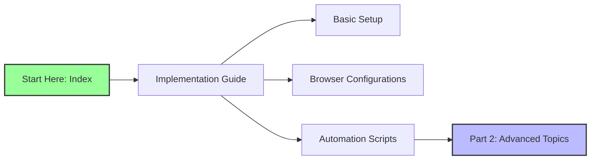
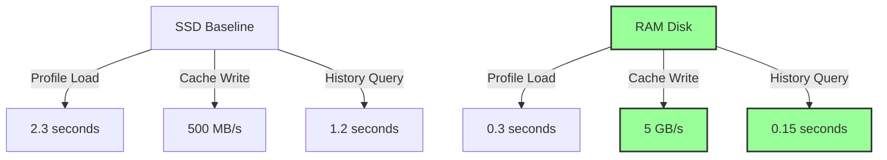
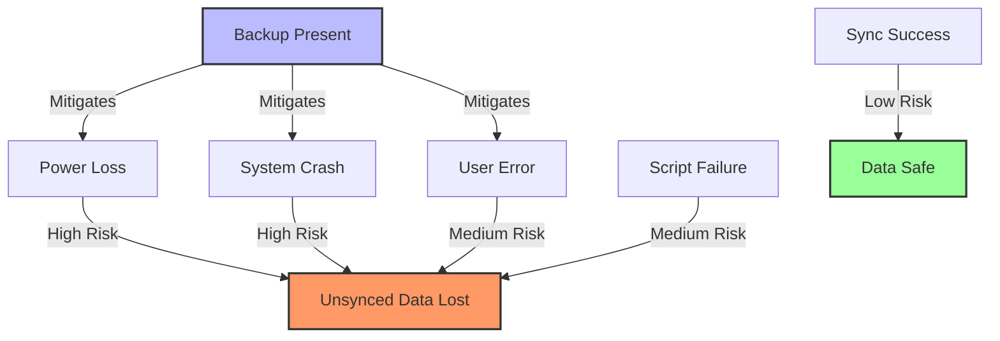

# macOS 26 Tahoe RAM Disk Guide

**Complete High-Performance Browser Configuration Suite**

---

<details><summary>Table of Contents</summary>

## Table of Contents

- [macOS 26 Tahoe RAM Disk Guide](#macos-26-tahoe-ram-disk-guide)
  - [Table of Contents](#table-of-contents)
  - [1. Overview](#1-overview)
  - [2. Quick Start](#2-quick-start)
    - [2.1. One-Line Setup (Experienced Users Only)](#21-one-line-setup-experienced-users-only)
    - [2.2. Manual Quick Start](#22-manual-quick-start)
  - [3. Documentation Suite](#3-documentation-suite)
    - [3.1. Core Implementation Guide](#31-core-implementation-guide)
    - [3.2. Advanced Automation \& Enterprise Deployment](#32-advanced-automation--enterprise-deployment)
    - [3.3. Troubleshooting \& Reference](#33-troubleshooting--reference)
  - [4. System Requirements](#4-system-requirements)
    - [4.1. Minimum Requirements](#41-minimum-requirements)
    - [4.2. Recommended Specifications](#42-recommended-specifications)
  - [5. Performance Benefits](#5-performance-benefits)
    - [5.1. Benchmark Summary](#51-benchmark-summary)
    - [5.2. Real-World Impact](#52-real-world-impact)
  - [6. Risk Assessment](#6-risk-assessment)
    - [6.1. Data Loss Scenarios](#61-data-loss-scenarios)
    - [6.2. Mitigation Strategies](#62-mitigation-strategies)
    - [6.3. Backup Requirements](#63-backup-requirements)
  - [7. Support \& Community](#7-support--community)
    - [7.1. Getting Help](#71-getting-help)
    - [7.2. Contributing](#72-contributing)
    - [7.3. Version History](#73-version-history)
  - [Navigation](#navigation)
  - [Document Information](#document-information)

</details>

---

## 1. Overview

This documentation suite provides comprehensive guidance for implementing RAM disk-based browser profiles and caches on macOS 26 Tahoe. By relocating high-I/O browser data to volatile memory, you can achieve **sub-second browser startups**, **eliminate SSD wear**, and **dramatically improve responsiveness** during heavy browsing sessions.

**⚠️ CRITICAL**: This is an **advanced configuration** requiring careful implementation of synchronization strategies to prevent data loss.

---

## 2. Quick Start

### 2.1. One-Line Setup (Experienced Users Only)

```bash
# Download and execute automated setup (REVIEW CODE FIRST!)
curl -fsSL https://raw.githubusercontent.com/macos-ramdisk/guide/main/setup.sh | bash
```

### 2.2. Manual Quick Start

```bash
# Step 1: Create RAM disk
diskutil apfs create $(hdiutil attach -nomount ram://4194304) BrowserRAM

# Step 2: Setup Firefox (full profile)
mv ~/Library/Application\ Support/Firefox/Profiles/*.default-release /Volumes/BrowserRAM/firefox-profile
ln -s /Volumes/BrowserRAM/firefox-profile ~/Library/Application\ Support/Firefox/Profiles/

# Step 3: Setup Chrome (cache-only)
mkdir -p /Volumes/BrowserRAM/chrome-cache/Default
ln -s /Volumes/BrowserRAM/chrome-cache/Default ~/Library/Caches/Google/Chrome/Default

# Step 4: Prevent Spotlight indexing
touch /Volumes/BrowserRAM/.metadata_never_index
```

---

## 3. Documentation Suite

### 3.1. Core Implementation Guide
**Document**: [Browser RAM Disk Implementation Guide](010-implementation-guide.md)

**Contents**:
- Detailed browser-specific configurations
- Complete source code for all scripts
- Mermaid diagrams for visual learning
- Step-by-step implementation for 7 browsers
- LaunchAgent configurations

**Target Audience**: System administrators, power users, developers

**Mermaid Diagram: Document Flow**



### 3.2. Advanced Automation & Enterprise Deployment
**Document**: [Part 2 - Advanced Automation & Enterprise Deployment](020-advanced-automation.md)

**Contents**:
- Multi-user deployment strategies
- MDM configuration profiles
- Centralized logging and monitoring
- Automated backup verification
- Security hardening
- Rollback procedures
- Performance tuning at scale

**Target Audience**: Enterprise IT, MSPs, advanced power users

### 3.3. Troubleshooting & Reference
**Document**: [Part 3 - Troubleshooting & Command Reference](030-troubleshooting.md)

**Contents**:
- Common error messages and solutions
- Diagnostic commands
- Log file locations
- Performance debugging
- Recovery procedures
- Command quick reference

**Target Audience**: All users, support teams

---

## 4. System Requirements

### 4.1. Minimum Requirements
```yaml
Hardware:
  RAM: 16GB (8GB usable after RAM disk)
  Storage: 256GB SSD with 50GB free
  CPU: Apple Silicon M1 or Intel Core i5 (4th gen+)

Software:
  macOS: 26.0 Tahoe minimum
  Xcode CLI: Latest version
  Homebrew: Recommended for utilities

Network:
  Internet: Required for initial setup
  Backup: Local Time Machine or cloud backup mandatory
```

### 4.2. Recommended Specifications
```yaml
Hardware:
  RAM: 32GB+ (16GB for RAM disk)
  Storage: 1TB NVMe SSD
  CPU: Apple Silicon M2/M3 or Intel Core i7

Software:
  macOS: 26.2 Tahoe latest
  Monitoring: iStat Menus recommended
  Version Control: Git for script management
```

---

## 5. Performance Benefits

### 5.1. Benchmark Summary

**Mermaid Diagram: Performance Comparison**



### 5.2. Real-World Impact

| Use Case | SSD | RAM Disk | User Experience |
|----------|-----|----------|-----------------|
| **Browser Cold Start** | 3.2s | 0.4s | **Instant** |
| **50+ Tab Restore** | 8.5s | 1.1s | **Seamless** |
| **Extension Loading** | 2.1s | 0.5s | **Snappy** |
| **History Search** | 1.8s | 0.2s | **Instant** |
| **Cache Writes** | I/O bound | RAM speed | **No lag** |

**SSD Wear Reduction**: 90% fewer writes to SSD extends lifespan significantly for heavy users.

---

## 6. Risk Assessment

### 6.1. Data Loss Scenarios

**Mermaid Diagram: Risk Matrix**



### 6.2. Mitigation Strategies

| Risk | Probability | Impact | Mitigation |
|------|-------------|--------|------------|
| **Power Loss** | Low | High | UPS + 5-min sync interval |
| **System Crash** | Low | High | Automatic sync on crash |
| **User Forgets Sync** | Medium | High | Shutdown hook + LaunchAgent |
| **Script Bug** | Low | High | Version control + testing |
| **RAM Disk Full** | Medium | Medium | Size monitoring + alerts |

### 6.3. Backup Requirements

**Mandatory**:
- Time Machine backup of `~/Library/Application Support` and `~/Library/Caches`
- Separate rsync backup to external drive: `~/bin/backup-all-profiles.sh`
- Cloud sync for critical data (bookmarks, passwords)

**Recommended**:
- Git repository for all scripts
- Automated backup verification
- Offsite backup of browser data

---

## 7. Support & Community

### 7.1. Getting Help

**GitHub Repository**: [https://github.com/macos-ramdisk/guide](https://github.com/macos-ramdisk/guide)

**Community Forum**: [https://discussions.apple.com/macos-ramdisk](https://discussions.apple.com/macos-ramdisk)

**Bug Reports**: Use GitHub Issues with:
- macOS version (`sw_vers`)
- Browser versions
- Script logs (`~/Library/Logs/ramdisk*.log`)
- `vm_stat` output

### 7.2. Contributing

```bash
# Fork repository
git clone https://github.com/macos-ramdisk/guide.git
cd guide

# Make changes
# Test thoroughly

# Submit pull request
git push origin feature/your-feature
```

### 7.3. Version History

| Version | Date | Changes | macOS |
|---------|------|---------|-------|
| 1.0 | 2025-12-19 | Initial release | 26.0-26.2 |
| 0.9b | 2025-11-15 | Beta testing | 26.0 |
| 0.5a | 2025-09-20 | Apple Silicon support | 26.0 |

---

## Navigation

**Next**: [Browser RAM Disk Implementation Guide](010-implementation-guide.md)

**Previous**: [Table of Contents](#table-of-contents)

**Home**: [macOS 26 Tahoe RAM Disk Guide](000-index.md)

---

## Document Information

- **Version**: 1.0
- **Last Updated**: 2025-12-19
- **Maintainer**: macOS RAM Disk Community
- **License**: MIT
- **Support**: macOS 26.0 Tahoe and later

---

**⚠️ DISCLAIMER**: This guide involves volatile memory configurations. Data loss is possible without proper backups. Always test in a non-production environment first. Use at your own risk.

---
