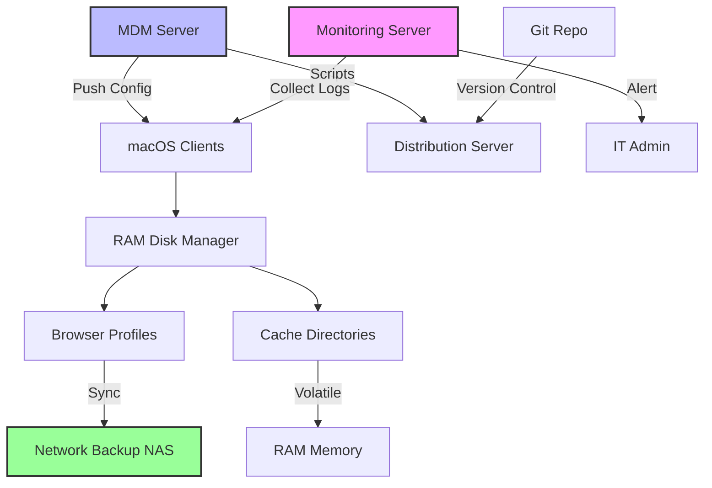
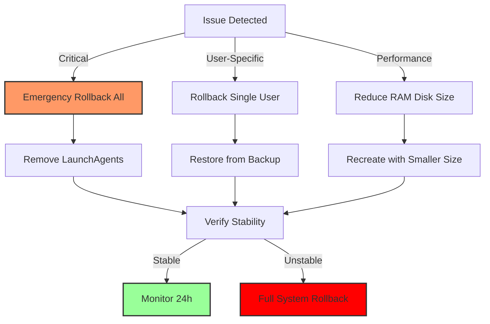
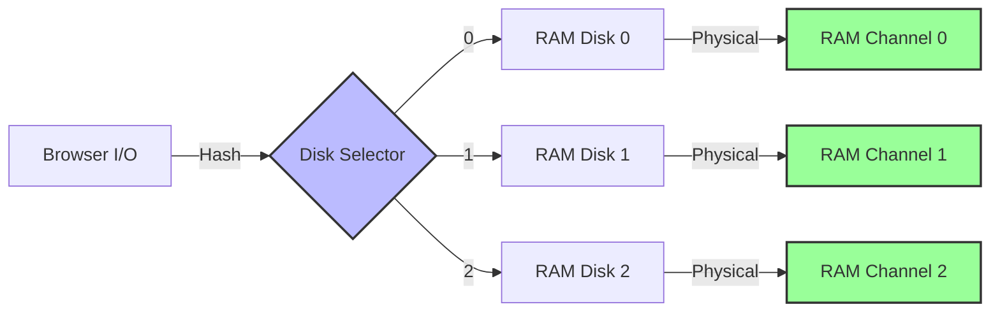

# Part 2 - Advanced Automation & Enterprise Deployment

**Multi-User & Large-Scale RAM Disk Management for macOS 26 Tahoe**

---

## Table of Contents

1. [Enterprise Architecture Overview](#1-enterprise-architecture-overview)
2. [Multi-User Deployment](#2-multi-user-deployment)
3. [MDM Configuration Profiles](#3-mdm-configuration-profiles)
4. [Centralized Monitoring & Logging](#4-centralized-monitoring--logging)
5. [Automated Backup Verification](#5-automated-backup-verification)
6. [Security Hardening](#6-security-hardening)
7. [Rollback & Recovery Procedures](#7-rollback--recovery-procedures)
8. [Performance Tuning at Scale](#8-performance-tuning-at-scale)

---

## 1. Enterprise Architecture Overview

### 1.1. Centralized Management Model

**Mermaid Diagram: Enterprise Deployment Architecture**



### 1.2. Key Components

| Component | Purpose | Technology |
|-----------|---------|------------|
| **MDM Server** | Policy deployment | Jamf Pro, Kandji, Mosyle |
| **Distribution Server** | Script distribution | GitLab, GitHub Enterprise |
| **Network Backup** | Centralized profile storage | NAS (Synology, QNAP) |
| **Monitoring** | Health checks & alerts | Prometheus, Grafana |
| **Git Repository** | Version control | GitLab, GitHub |

---

## 2. Multi-User Deployment

### 2.1. Per-User RAM Disk Sizing

**Dynamic RAM Allocation Script**:
```bash
#!/bin/bash
# /usr/local/bin/ramdisk-enterprise.sh

# Source: Enterprise IT Script Library v2.1

set -euo pipefail

# Configuration
TOTAL_RAM=$(sysctl -n hw.memsize | awk '{print int($1/1024/1024/1024)}')
MAX_ALLOC_PERCENT=${MAX_ALLOC_PERCENT:-25}
MIN_FREE_RAM=${MIN_FREE_RAM:-4}

calculate_ramdisk_size() {
    local available_ram=$(( TOTAL_RAM - MIN_FREE_RAM ))
    local max_allowed=$(( TOTAL_RAM * MAX_ALLOC_PERCENT / 100 ))
    local recommended=$(( available_ram < max_allowed ? available_ram : max_allowed ))
    
    # Round down to nearest power of 2 for efficiency
    local size=1
    while [[ $size -lt $recommended && $size -lt 16 ]]; do
        size=$(( size * 2 ))
    done
    
    echo $size
}

create_user_ramdisk() {
    local user=$1
    local size=$(calculate_ramdisk_size)
    local mount_point="/Volumes/BrowserRAM_$user"
    
    # Create RAM disk with user-specific name
    local device=$(hdiutil attach -nomount ram://$(( size * 2097152 )) 2>/dev/null | awk '/^\/dev/{print $1; exit}')
    
    if [[ -z "$device" ]]; then
        logger -t "ramdisk-enterprise" "ERROR: Failed to create RAM disk for $user"
        return 1
    fi
    
    diskutil apfs create "$device" "BrowserRAM_$user" >/dev/null
    
    # Set ownership
    chown "$user:staff" "$mount_point"
    chmod 755 "$mount_point"
    
    # Prevent Spotlight
    touch "$mount_point/.metadata_never_index"
    
    logger -t "ramdisk-enterprise" "Created ${size}GB RAM disk for $user at $mount_point"
    echo "$mount_point"
}

# Main execution
case "${1:-}" in
    create) create_user_ramdisk "$2" ;;
    size) calculate_ramdisk_size ;;
    *) echo "Usage: $0 create <username> | size" >&2; exit 1 ;;
esac
```

### 2.2. User Login Hook

**LaunchAgent for per-user RAM disk**:
```xml
<!-- /Library/LaunchAgents/com.enterprise.ramdisk.plist -->
<?xml version="1.0" encoding="UTF-8"?>
<!DOCTYPE plist PUBLIC "-//Apple//DTD PLIST 1.0//EN" "http://www.apple.com/DTDs/PropertyList-1.0.dtd">
<plist version="1.0">
<dict>
    <key>Label</key>
    <string>com.enterprise.ramdisk</string>
    <key>ProgramArguments</key>
    <array>
        <string>/bin/bash</string>
        <string>-c</string>
        <string>
            USER=$(stat -f%Su /dev/console)
            /usr/local/bin/ramdisk-enterprise.sh create "$USER"
        </string>
    </array>
    <key>RunAtLoad</key>
    <true/>
    <key>LimitLoadToSessionType</key>
    <array>
        <string>Aqua</string>
    </array>
</dict>
</plist>
```

### 2.3. Group Policy Integration

**Jamf Pro Script**:
```bash
#!/bin/bash
# Jamf Pro policy script

# Parameters
RAMDISK_SIZE=${4:-4}  # GB
ENABLE_FIREFOX=${5:-"true"}
ENABLE_CHROME=${6:-"true"}

# Create RAM disk
/usr/local/bin/ramdisk-enterprise.sh create "$USER" "$RAMDISK_SIZE"

# Setup browsers based on policy
if [[ "$ENABLE_FIREFOX" == "true" ]]; then
    sudo -u "$USER" /Users/$USER/bin/firefox-ramsync.sh start
fi

if [[ "$ENABLE_CHROME" == "true" ]]; then
    sudo -u "$USER" /Users/$USER/bin/setup-chrome-cache.sh
fi

# Report success
jamf policy -event ramdiskConfigured
```

---

## 3. MDM Configuration Profiles

### 3.1. Jamf Pro Configuration Profile

**Custom Settings Profile**:
```xml
<?xml version="1.0" encoding="UTF-8"?>
<!DOCTYPE plist PUBLIC "-//Apple//DTD PLIST 1.0//EN" "http://www.apple.com/DTDs/PropertyList-1.0.dtd">
<plist version="1.0">
<dict>
    <key>PayloadContent</key>
    <array>
        <dict>
            <key>PayloadDescription</key>
            <string>RAM Disk Configuration</string>
            <key>PayloadDisplayName</key>
            <string>Browser RAM Disk</string>
            <key>PayloadIdentifier</key>
            <string>com.enterprise.ramdisk.config</string>
            <key>PayloadType</key>
            <string>com.apple.ManagedClient.preferences</string>
            <key>PayloadUUID</key>
            <string>12345678-1234-1234-1234-123456789012</string>
            <key>PayloadVersion</key>
            <integer>1</integer>
            <key>PayloadContent</key>
            <dict>
                <key>com.enterprise.ramdisk</key>
                <dict>
                    <key>Forced</key>
                    <array>
                        <dict>
                            <key>mcx_preference_settings</key>
                            <dict>
                                <key>RAMDiskSizeGB</key>
                                <integer>4</integer>
                                <key>EnableFirefox</key>
                                <true/>
                                <key>EnableChrome</key>
                                <true/>
                                <key>SyncIntervalMinutes</key>
                                <integer>15</integer>
                                <key>BackupServer</key>
                                <string>nas.enterprise.local</string>
                            </dict>
                        </dict>
                    </array>
                </dict>
            </dict>
        </dict>
    </array>
    <key>PayloadDescription</key>
    <string>Configures browser RAM disk settings</string>
    <key>PayloadDisplayName</key>
    <string>Browser RAM Disk Policy</string>
    <key>PayloadIdentifier</key>
    <string>com.enterprise.ramdisk.master</string>
    <key>PayloadType</key>
    <string>Configuration</string>
    <key>PayloadUUID</key>
    <string>87654321-4321-4321-4321-210987654321</string>
    <key>PayloadVersion</key>
    <integer>1</integer>
</dict>
</plist>
```

### 3.2. Mosyle Custom Command

**Mosyle MDM Custom Command**:
```bash
#!/bin/bash
# Mosyle Custom Command: Setup RAM Disk

# Install enterprise scripts
curl -fsSL https://git.enterprise.local/scripts/ramdisk-enterprise.sh -o /usr/local/bin/ramdisk-enterprise.sh
chmod +x /usr/local/bin/ramdisk-enterprise.sh

# Create LaunchAgent for all users
for user_dir in /Users/*; do
    user=$(basename "$user_dir")
    if [[ "$user" != "Shared" && "$user" != "Guest" ]]; then
        cp /Library/Application\ Support/Mosyle/ramdisk.plist "$user_dir/Library/LaunchAgents/"
        chown "$user:staff" "$user_dir/Library/LaunchAgents/ramdisk.plist"
    fi
done

# Trigger policy
mosyle --policy --ramdiskSetup
```

---

## 4. Centralized Monitoring & Logging

### 4.1. Prometheus Node Exporter

**Custom Metrics Script**:
```bash
#!/bin/bash
# /usr/local/bin/ramdisk-metrics.sh

# Prometheus metrics endpoint for RAM disk

RAM_DISK="/Volumes/BrowserRAM"
METRICS_FILE="/tmp/ramdisk-metrics.prom"

# Generate metrics
cat > "$METRICS_FILE" <<EOF
# HELP ramdisk_size_bytes Total size of RAM disk
# TYPE ramdisk_size_bytes gauge
ramdisk_size_bytes $(df -b "$RAM_DISK" 2>/dev/null | awk 'NR==2{print $2}' || echo 0)

# HELP ramdisk_used_bytes Used bytes on RAM disk
# TYPE ramdisk_used_bytes gauge
ramdisk_used_bytes $(df -b "$RAM_DISK" 2>/dev/null | awk 'NR==2{print $3}' || echo 0)

# HELP ramdisk_sync_success_total Total successful syncs
# TYPE ramdisk_sync_success_total counter
ramdisk_sync_success_total $(grep -c "sync successful" "$HOME/Library/Logs/ramdisk.log" 2>/dev/null || echo 0)

# HELP ramdisk_sync_failures_total Total sync failures
# TYPE ramdisk_sync_failures_total counter
ramdisk_sync_failures_total $(grep -c "sync failed" "$HOME/Library/Logs/ramdisk.log" 2>/dev/null || echo 0)
EOF

# Serve metrics (called by node_exporter textfile collector)
cat "$METRICS_FILE"
```

### 4.2. Grafana Dashboard

**Dashboard JSON** (excerpt):
```json
{
  "dashboard": {
    "title": "macOS RAM Disk Monitoring",
    "panels": [
      {
        "id": 1,
        "title": "RAM Disk Usage",
        "type": "graph",
        "targets": [
          {
            "expr": "ramdisk_used_bytes / ramdisk_size_bytes * 100",
            "legendFormat": "Usage %"
          }
        ]
      },
      {
        "id": 2,
        "title": "Sync Failures",
        "type": "stat",
        "targets": [
          {
            "expr": "increase(ramdisk_sync_failures_total[1h])",
            "legendFormat": "Failures/hour"
          }
        ],
        "thresholds": {
          "mode": "absolute",
          "steps": [
            {"color": "green", "value": null},
            {"color": "red", "value": 1}
          ]
        }
      }
    ]
  }
}
```

### 4.3. Centralized Log Collection

**rsyslog configuration**:
```bash
# /etc/rsyslog.d/60-ramdisk.conf
# Forward RAM disk logs to central server

$ModLoad imfile
$InputFileName /Users/*/Library/Logs/ramdisk.log
$InputFileTag ramdisk:
$InputFileStateFile stat-ramdisk
$InputFileSeverity info
$InputFileFacility local6
$InputRunFileMonitor

# Forward to central log server
*.* @@log.enterprise.local:514
```

---

## 5. Automated Backup Verification

### 5.1. Backup Integrity Checker

```bash
#!/bin/bash
# /usr/local/bin/ramdisk-verify-backup.sh

set -euo pipefail

BACKUP_ROOT="/Volumes/BackupNAS/browser-backups"
LOG_FILE="/var/log/ramdisk-verify.log"
ALERT_EMAIL="admin@enterprise.local"

verify_user_backup() {
    local user=$1
    local user_backup="$BACKUP_ROOT/$user"
    
    if [[ ! -d "$user_backup" ]]; then
        echo "CRITICAL: No backup found for $user" | tee -a "$LOG_FILE"
        return 1
    fi
    
    # Check Firefox backup
    if [[ -d "$user_backup/firefox" ]]; then
        local firefox_files=$(find "$user_backup/firefox" -type f | wc -l)
        if [[ $firefox_files -lt 100 ]]; then
            echo "WARNING: Firefox backup for $user seems incomplete ($firefox_files files)" | tee -a "$LOG_FILE"
        fi
    fi
    
    # Check Chrome cache structure
    if [[ -L "/Users/$user/Library/Caches/Google/Chrome/Default" ]]; then
        local cache_target=$(readlink "/Users/$user/Library/Caches/Google/Chrome/Default")
        if [[ ! -d "$cache_target" ]]; then
            echo "ERROR: Chrome cache symlink broken for $user" | tee -a "$LOG_FILE"
        fi
    fi
    
    # Check backup age
    local backup_age=$(find "$user_backup" -name "*.sqlite" -mtime +1 | wc -l)
    if [[ $backup_age -gt 0 ]]; then
        echo "WARNING: Backup for $user is older than 24h" | tee -a "$LOG_FILE"
    fi
    
    echo "OK: Backup verification passed for $user" | tee -a "$LOG_FILE"
}

# Main execution
for user_home in /Users/*; do
    user=$(basename "$user_home")
    if [[ "$user" != "Shared" && "$user" != "Guest" && -d "$user_home" ]]; then
        verify_user_backup "$user" || echo "ALERT: Backup verification failed for $user" | mail -s "RAM Disk Backup Alert" "$ALERT_EMAIL"
    fi
done

# Cleanup old logs
find /var/log -name "ramdisk-verify*.log" -mtime +7 -delete
```

### 5.2. Automated Restore Testing

```bash
#!/bin/bash
# /usr/local/bin/ramdisk-test-restore.sh

# Test restore procedure without affecting production

TEST_USER="ramdisk-test-$(date +%s)"
TEST_DIR="/tmp/$TEST_USER"

setup_test_environment() {
    mkdir -p "$TEST_DIR/home"
    export HOME="$TEST_DIR/home"
    export USER="$TEST_USER"
}

test_firefox_restore() {
    # Create mock backup
    mkdir -p "/Volumes/BackupNAS/browser-backups/$TEST_USER/firefox"
    cp -R /Users/admin/Library/Application\ Support/Firefox/Profiles/* "/Volumes/BackupNAS/browser-backups/$TEST_USER/firefox/"
    
    # Run restore
    /usr/local/bin/ramdisk-enterprise.sh create "$TEST_USER" 2
    /Users/admin/bin/firefox-ramsync.sh start
    
    # Verify
    if [[ -d "$TEST_DIR/home/Library/Application Support/Firefox/Profiles" ]]; then
        echo "SUCCESS: Firefox restore test passed"
        return 0
    else
        echo "FAILURE: Firefox restore test failed"
        return 1
    fi
}

cleanup_test() {
    rm -rf "$TEST_DIR"
    diskutil unmount "/Volumes/BrowserRAM_$TEST_USER" 2>/dev/null || true
}

# Main
setup_test_environment
test_firefox_restore
cleanup_test
```

---

## 6. Security Hardening

### 6.1. File Permissions & ACLs

```bash
#!/bin/bash
# /usr/local/bin/ramdisk-secure-permissions.sh

set -euo pipefail

# Set restrictive permissions on scripts
chmod 750 /usr/local/bin/ramdisk-*.sh
chown root:wheel /usr/local/bin/ramdisk-*.sh

# Set ACLs on backup directory
BACKUP_ROOT="/Volumes/BackupNAS/browser-backups"

# Remove existing ACLs
chmod -R -N "$BACKUP_ROOT" 2>/dev/null || true

# Apply new ACLs
for user_home in /Users/*; do
    user=$(basename "$user_home")
    if [[ "$user" != "Shared" && "$user" != "Guest" ]]; then
        user_backup="$BACKUP_ROOT/$user"
        mkdir -p "$user_backup"
        
        # User can read/write own backup
        chmod +a "$user allow list,add_file,search,delete,add_subdirectory,delete_child,readattr,writeattr,readextattr,writeextattr,readsecurity,file_inherit,directory_inherit" "$user_backup"
        
        # Admin can read all backups
        chmod +a "admin allow list,search,readattr,readextattr,readsecurity,file_inherit,directory_inherit" "$user_backup"
        
        # Others denied
        chmod 700 "$user_backup"
    fi
done

# Set immutable flag on scripts
chflags schg /usr/local/bin/ramdisk-*.sh
```

### 6.2. Keychain Security for Chrome

**Chrome Safe Storage key migration**:
```bash
#!/bin/bash
# /usr/local/bin/ramdisk-secure-chrome-key.sh

# Chrome stores encryption keys in Keychain. This script ensures keys are accessible
# after profile relocation.

USER_HOME="/Users/$1"
USER="$1"

# Unlock keychain
security unlock-keychain -p "$PASSWORD" "$USER_HOME/Library/Keychains/login.keychain-db"

# Verify Chrome Safe Storage key exists
if ! security find-generic-password -l "Chrome Safe Storage" "$USER_HOME/Library/Keychains/login.keychain-db" >/dev/null 2>&1; then
    echo "WARNING: Chrome Safe Storage key not found for $USER"
    # Trigger Chrome to recreate key
    sudo -u "$USER" open -a "Google Chrome" --args --disable-extensions --no-first-run
    sleep 5
    pkill -f "Google Chrome"
fi

# Set keychain permissions
security set-keychain-settings -t 3600 -l "$USER_HOME/Library/Keychains/login.keychain-db"
```

---

## 7. Rollback & Recovery Procedures

### 7.1. Emergency Rollback Script

```bash
#!/bin/bash
# /usr/local/bin/ramdisk-emergency-rollback.sh

set -euo pipefail

LOG_FILE="/var/log/ramdisk-rollback.log"
BACKUP_ROOT="/Volumes/BackupNAS/browser-backups"

rollback_user() {
    local user=$1
    echo "Rolling back $user..." | tee -a "$LOG_FILE"
    
    # Stop all browsers
    sudo -u "$user" pkill -f "Firefox|Chrome|Safari|Wavebox|Zen|Helium|Orion" || true
    
    # Restore Firefox profile
    local firefox_profile="/Users/$user/Library/Application Support/Firefox/Profiles"
    if [[ -L "$firefox_profile" ]]; then
        rm "$firefox_profile"
        cp -R "$BACKUP_ROOT/$user/firefox" "$firefox_profile"
    fi
    
    # Restore Chrome cache
    local chrome_cache="/Users/$user/Library/Caches/Google/Chrome/Default"
    if [[ -L "$chrome_cache" ]]; then
        rm "$chrome_cache"
        mkdir -p "$chrome_cache"
        cp -R "$BACKUP_ROOT/$user/chrome-cache/Default" "$chrome_cache"
    fi
    
    # Remove RAM disk
    diskutil unmount "/Volumes/BrowserRAM_$user" 2>/dev/null || true
    
    echo "Rollback complete for $user" | tee -a "$LOG_FILE"
}

# Rollback all users or specific user
if [[ "${1:-all}" == "all" ]]; then
    for user_home in /Users/*; do
        user=$(basename "$user_home")
        if [[ "$user" != "Shared" && "$user" != "Guest" && -d "$user_home" ]]; then
            rollback_user "$user"
        fi
    done
else
    rollback_user "$1"
fi

# Disable LaunchAgents
launchctl unload -w /Library/LaunchAgents/com.enterprise.ramdisk.plist 2>/dev/null || true
```

### 7.2. Gradual Rollback Strategy

**Mermaid Diagram: Rollback Decision Tree**



### 7.3. Versioned Rollback

```bash
#!/bin/bash
# /usr/local/bin/ramdisk-versioned-rollback.sh

# Rollback to specific backup version

USER=$1
VERSION=${2:-latest}  # Use timestamp or "latest"

BACKUP_ROOT="/Volumes/BackupNAS/browser-backups"
VERSION_DIR="$BACKUP_ROOT/$USER/versions"

if [[ "$VERSION" == "latest" ]]; then
    VERSION=$(ls -t "$VERSION_DIR" | head -n1)
fi

RESTORE_DIR="$VERSION_DIR/$VERSION"

if [[ ! -d "$RESTORE_DIR" ]]; then
    echo "ERROR: Version $VERSION not found"
    exit 1
fi

# Restore procedure
echo "Restoring $USER to version $VERSION..."
rsync -av --delete "$RESTORE_DIR/" "/Users/$user/Library/Application Support/Firefox/Profiles/"
```

---

## 8. Performance Tuning at Scale

### 8.1. APFS Tuning Parameters

```bash
#!/bin/bash
# /usr/local/bin/ramdisk-apfs-tune.sh

# Optimize APFS for RAM disk workload

RAM_DISK="/Volumes/BrowserRAM"

# Disable last access time updates (reduces writes)
sudo mount -u -o noatime "$RAM_DISK"

# Increase metadata cache (if supported)
sysctl -w vfs.generic.apfs.max_metadata_cache_size=134217728

# Disable protection for better performance (enterprise risk assessment required)
diskutil apfs changeVolumeRole "$RAM_DISK" 0 2>/dev/null || true
```

### 8.2. Memory Pressure Management

**Memory pressure handler**:
```bash
#!/bin/bash
# /usr/local/bin/ramdisk-memory-pressure.sh

# Monitors memory pressure and reduces RAM disk size if needed

MEMORY_PRESSURE=$(memory_pressure | grep "System-wide memory free percentage" | awk '{print $NF}' | tr -d '%')

if [[ $MEMORY_PRESSURE -lt 10 ]]; then
    echo "CRITICAL: Memory pressure high (${MEMORY_PRESSURE}% free)"
    
    # Reduce RAM disk size by 50%
    CURRENT_SIZE=$(df -g /Volumes/BrowserRAM | awk 'NR==2{print $2}')
    NEW_SIZE=$(( CURRENT_SIZE / 2 ))
    
    # Recreate with smaller size
    /usr/local/bin/ramdisk-manager.sh destroy
    /usr/local/bin/ramdisk-manager.sh create "$NEW_SIZE"
    
    # Alert admin
    echo "RAM disk resized to ${NEW_SIZE}GB due to memory pressure" | mail -s "RAM Disk Alert" admin@enterprise.local
fi
```

### 8.3. Load Balancing Across Multiple RAM Disks

**Mermaid Diagram: Multi-Disk Striping**



**Implementation**:
```bash
#!/bin/bash
# /usr/local/bin/ramdisk-striped.sh

# Create multiple smaller RAM disks for load distribution

DISK_COUNT=${1:-2}
DISK_SIZE=${2:-2}  # GB per disk

for i in $(seq 0 $((DISK_COUNT - 1))); do
    device=$(hdiutil attach -nomount ram://$(( DISK_SIZE * 2097152 )) | awk '/^\/dev/{print $1; exit}')
    diskutil apfs create "$device" "BrowserRAM_$i"
    touch "/Volumes/BrowserRAM_$i/.metadata_never_index"
done

# Create union mount (requires macFUSE - optional)
# mkdir -p /Volumes/BrowserRAM_Union
# mergerfs /Volumes/BrowserRAM_* /Volumes/BrowserRAM_Union
```

---

## Navigation

**Next**: [Part 3 - Troubleshooting & Command Reference](030-troubleshooting.md)

**Previous**: [Browser RAM Disk Implementation Guide](010-implementation-guide.md)

**Home**: [macOS 26 Tahoe RAM Disk Guide](000-index.md)

---

## Document Information

- **Version**: 1.0
- **Last Updated**: 2025-12-19
- **Target Audience**: Enterprise IT, MSPs, Advanced Power Users
- **Prerequisites**: Part 1 (Implementation Guide)
- **Deployment Scale**: 10-10,000+ macOS systems

---
