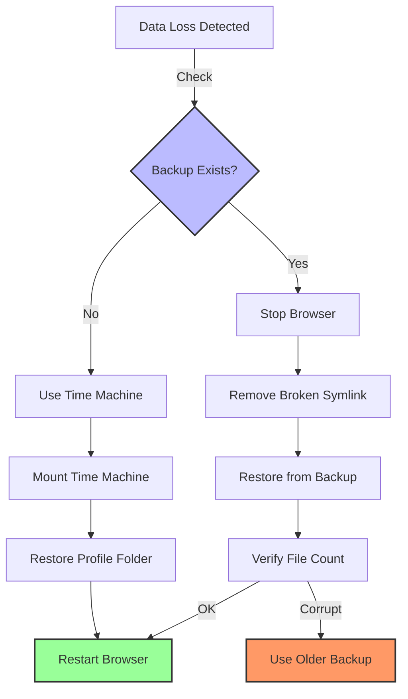
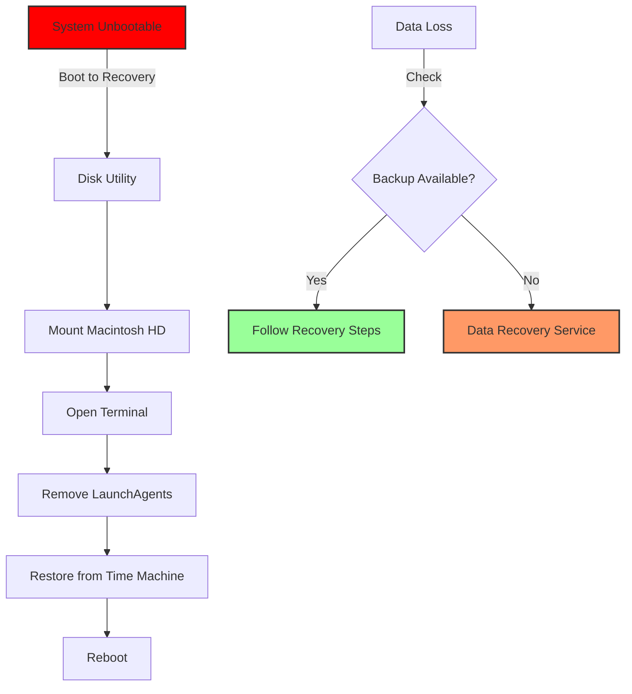

# Part 3 - Troubleshooting & Command Reference

**Comprehensive Diagnostic & Recovery Guide for macOS 26 Tahoe RAM Disk Configurations**

---

## Table of Contents

1. [Diagnostic Command Reference](#1-diagnostic-command-reference)
2. [Common Error Messages & Solutions](#2-common-error-messages--solutions)
3. [Log File Locations & Analysis](#3-log-file-locations--analysis)
4. [Performance Debugging](#4-performance-debugging)
5. [Recovery Procedures](#5-recovery-procedures)
6. [FAQ & Quick Fixes](#6-faq--quick-fixes)
7. [Browser-Specific Issues](#7-browser-specific-issues)
8. [Emergency Procedures](#8-emergency-procedures)

---

## 1. Diagnostic Command Reference

### 1.1. RAM Disk Status Commands

```bash
# Check RAM disk existence and mount point
diskutil list | grep -i "BrowserRAM"
df -h /Volumes/BrowserRAM*

# Verify APFS formatting
diskutil info /Volumes/BrowserRAM | grep "Type (Bundle)"

# Check RAM disk device
hdiutil info | grep "BrowserRAM"

# Monitor RAM disk I/O
sudo iostat -w 1 -d disk2  # Replace disk2 with actual RAM disk device

# Check memory usage
vm_stat 1
```

### 1.2. Browser Profile Verification

```bash
# Firefox profile symlink check
ls -la ~/Library/Application\ Support/Firefox/Profiles/*.default-release

# Chrome cache symlink check
ls -la ~/Library/Caches/Google/Chrome/Default

# Verify symlink targets are accessible
readlink -f ~/Library/Application\ Support/Firefox/Profiles/*.default-release

# Check profile file count (should be > 100 files)
find /Volumes/BrowserRAM/firefox-profile -type f | wc -l
```

### 1.3. Sync Process Diagnostics

```bash
# Check if sync scripts are running
pgrep -f "firefox-ramsync.sh"

# Monitor rsync activity
sudo fs_usage -f filesys | grep rsync

# Check cron jobs
crontab -l | grep ramsync

# Verify LaunchAgent status
launchctl list | grep ramdisk
```

### 1.4. Network & Backup Verification

```bash
# Test NAS connectivity
ping -c 3 nas.enterprise.local

# Check backup mount
df -h /Volumes/BackupNAS

# Verify backup file age
find ~/.browser-backup -name "*.sqlite" -mtime +1

# Test rsync to backup
rsync -av --dry-run /Volumes/BrowserRAM/firefox-profile/ ~/.browser-backup/firefox/
```

---

## 2. Common Error Messages & Solutions

### 2.1. RAM Disk Creation Errors

**Error**: `hdiutil: attach failed - No space left on device`
```bash
# Diagnosis
vm_stat | grep "Pages free"
# Should show > 1,000,000 pages free (4GB)

# Solution
sudo purge  # Clear inactive memory
# Or reduce RAM disk size
diskutil apfs create $(hdiutil attach -nomount ram://2097152) BrowserRAM  # 1GB
```

**Error**: `Resource temporarily unavailable`
```bash
# Diagnosis: Check existing RAM disks
hdiutil info | grep "RAM" | wc -l

# Solution: Remove orphaned disks
for disk in $(hdiutil info | grep "RAM" | awk '{print $1}'); do
    hdiutil detach "$disk" -force
done
```

**Error**: `APFS container create failed: error -69830`
```bash
# Diagnosis: Device not properly attached
hdiutil attach -nomount ram://4194304

# Solution: Use full device path
device=$(hdiutil attach -nomount ram://4194304 | awk '/^\/dev/{print $1}')
diskutil apfs create "$device" BrowserRAM
```

### 2.2. Browser Launch Errors

**Error**: `Profile missing or inaccessible`
```bash
# Diagnosis
ls -la ~/Library/Application\ Support/Firefox/Profiles/

# Solution: Recreate symlink
rm ~/Library/Application\ Support/Firefox/Profiles/*.default-release
ln -s /Volumes/BrowserRAM/firefox-profile ~/Library/Application\ Support/Firefox/Profiles/
```

**Error**: `Chrome: Your profile could not be opened correctly`
```bash
# Diagnosis: Keychain access issue
security find-generic-password -l "Chrome Safe Storage"

# Solution: Reset Chrome profile (cache-only is safe)
rm -rf ~/Library/Caches/Google/Chrome/Default
mkdir -p /Volumes/BrowserRAM/chrome-cache/Default
ln -s /Volumes/BrowserRAM/chrome-cache/Default ~/Library/Caches/Google/Chrome/Default
```

**Error**: `Safari: Can't find profile`
```bash
# Diagnosis: Container path issue
ls -la ~/Library/Containers/com.apple.Safari/

# Solution: Recreate container cache symlink
mkdir -p /Volumes/BrowserRAM/safari-container-cache
ln -sf /Volumes/BrowserRAM/safari-container-cache \
  ~/Library/Containers/com.apple.Safari/Data/Library/Caches/com.apple.Safari
```

### 2.3. Sync Failures

**Error**: `rsync: failed to set times on ... Operation not permitted`
```bash
# Diagnosis: Permission issue
ls -la ~/.browser-backup/

# Solution: Fix ownership
sudo chown -R $USER:staff ~/.browser-backup/
```

**Error**: `rsync: No space left on device`
```bash
# Diagnosis
df -h ~/.browser-backup/

# Solution: Clean old backups
find ~/.browser-backup -name "*.old" -mtime +7 -delete
```

**Error**: `LaunchAgent: Service could not initialize`
```bash
# Diagnosis
launchctl list | grep ramdisk
launchctl print gui/$(id -u)/ramdisk-browser-master

# Solution: Reload agent
launchctl unload ~/Library/LaunchAgents/ramdisk-browser-master.plist
launchctl load -w ~/Library/LaunchAgents/ramdisk-browser-master.plist
```

---

## 3. Log File Locations & Analysis

### 3.1. Log File Structure

```bash
# RAM disk master log
~/Library/Logs/ramdisk.log

# Browser-specific logs
~/Library/Logs/firefox-ramdisk.log
~/Library/Logs/chrome-ramdisk.log
~/Library/Logs/safari-ramdisk.log

# System logs
/var/log/system.log
/var/log/install.log

# MDM logs (enterprise)
/var/log/jamf.log
/var/log/mosyle.log
```

### 3.2. Log Analysis Commands

```bash
# Monitor real-time logs
tail -f ~/Library/Logs/ramdisk*.log

# Search for errors
grep -i error ~/Library/Logs/ramdisk.log

# Count sync events
grep -c "sync successful" ~/Library/Logs/ramdisk.log

# Find last failure
grep -A5 -B5 "failed" ~/Library/Logs/ramdisk.log | tail -n20

# Parse timestamps
grep "$(date '+%Y-%m-%d')" ~/Library/Logs/ramdisk.log

# Combine all logs
cat ~/Library/Logs/ramdisk*.log | sort > /tmp/ramdisk-combined.log
```

### 3.3. Log Rotation Configuration

```bash
# /etc/newsyslog.d/ramdisk.conf
# Log rotation for RAM disk logs

# Log file                Mode  Count  Size   When  Flags  Path
/Users/*/Library/Logs/ramdisk.log  644  7  10M  *  G  /usr/bin/gzip
/Users/*/Library/Logs/firefox-ramdisk.log  644  7  10M  *  G  /usr/bin/gzip
```

---

## 4. Performance Debugging

### 4.1. Memory Pressure Analysis

```bash
# Check memory pressure level
memory_pressure

# Sample output:
# System-wide memory free percentage: 85%
# System-wide memory pressure: normal

# If pressure is "critical" or "warning":
# 1. Check process memory usage
ps aux | sort -nr -k 4 | head -n20

# 2. Identify RAM disk size
df -h /Volumes/BrowserRAM

# 3. Reduce RAM disk size
~/bin/ramdisk-manager.sh destroy
~/bin/ramdisk-manager.sh create 2  # Reduce from 4GB to 2GB
```

### 4.2. I/O Bottleneck Identification

```bash
# Monitor RAM disk I/O
sudo iostat -w 1 -d disk3  # Replace disk3 with RAM disk device

# Expected output for healthy RAM disk:
#              disk3 
#    KB/t tps  MB/s 
#  256.00  100  25.00

# If tps > 1000, consider:
# - Increasing RAM disk size
# - Reducing sync frequency
# - Checking for runaway processes

# Find processes accessing RAM disk
sudo fs_usage -f filesys | grep "BrowserRAM"
```

### 4.3. Sync Performance Tuning

```bash
# Benchmark rsync speed
time rsync -av /Volumes/BrowserRAM/firefox-profile/ ~/.browser-backup/firefox/

# Expected: < 5 seconds for 1GB profile

# If slow:
# 1. Check network (NAS backup)
ping -c 3 nas.local

# 2. Check disk I/O
sudo iotop -C 5

# 3. Use rsync options
rsync -av --no-compress --whole-file /Volumes/BrowserRAM/firefox-profile/ ~/.browser-backup/firefox/
```

---

## 5. Recovery Procedures

### 5.1. Complete Profile Recovery

**Mermaid Diagram: Recovery Flowchart**



**Step-by-Step Recovery**:
```bash
# 1. Stop browser
pkill -f Firefox

# 2. Remove broken symlink
rm ~/Library/Application\ Support/Firefox/Profiles/*.default-release

# 3. Restore from backup
cp -R ~/.browser-backup/firefox/*.default-release \
  ~/Library/Application\ Support/Firefox/Profiles/

# 4. Verify restoration
find ~/Library/Application\ Support/Firefox/Profiles/*.default-release -name "*.sqlite" | wc -l
# Should return > 50 files

# 5. Restart browser
open -a Firefox
```

### 5.2. Partial Data Recovery

```bash
# Recover only specific files (e.g., bookmarks)
sqlite3 ~/Library/Application\ Support/Firefox/Profiles/*.default-release/places.sqlite \
  ".backup ~/.browser-backup/firefox/bookmarks-recovery.sqlite"

# Recover Chrome history
cp ~/.browser-backup/chrome/Default/History \
  ~/Library/Application\ Support/Google/Chrome/Default/
```

### 5.3. Time Machine Recovery

```bash
# Find backup versions
tmutil listbackups | grep -A5 -B5 "$(date '+%Y-%m-%d')"

# Enter Time Machine
tmutil

# Restore specific folder
tmutil restore '/Volumes/Time Machine/Backups.backupdb/.../Latest/Macintosh HD/Users/user/Library/Application Support/Firefox' \
  ~/Library/Application\ Support/Firefox
```

---

## 6. FAQ & Quick Fixes

### 6.1. Frequently Asked Questions

**Q: How do I check if my RAM disk is working?**
```bash
# Quick check
df -h /Volumes/BrowserRAM
# Should show mounted volume

# Write test
dd if=/dev/zero of=/Volumes/BrowserRAM/test bs=1m count=100
# Should complete in < 1 second

# Cleanup
rm /Volumes/BrowserRAM/test
```

**Q: Browser is slow after RAM disk setup**
```bash
# Diagnosis: Check if actually using RAM disk
readlink ~/Library/Application\ Support/Firefox/Profiles/*.default-release

# Fix: Ensure symlink points to RAM disk, not backup
ls -la ~/Library/Application\ Support/Firefox/Profiles/
# Should show: ... -> /Volumes/BrowserRAM/firefox-profile
```

**Q: RAM disk disappears after sleep**
```bash
# Solution: Add wake hook
# ~/Library/LaunchAgents/ramdisk-wake.plist
<?xml version="1.0" encoding="UTF-8"?>
<!DOCTYPE plist PUBLIC "-//Apple//DTD PLIST 1.0//EN" "http://www.apple.com/DTDs/PropertyList-1.0.dtd">
<plist version="1.0">
<dict>
    <key>Label</key>
    <string>ramdisk-wake</string>
    <key>ProgramArguments</key>
    <array>
        <string>/bin/bash</string>
        <string>-c</string>
        <string>
            sleep 5
            if [[ ! -d /Volumes/BrowserRAM ]]; then
                ~/bin/ramdisk-manager.sh create 4
                ~/bin/browser-sync-master.sh start
            fi
        </string>
    </array>
    <key>WatchPaths</key>
    <array>
        <string>/private/tmp/.wake</string>
    </array>
</dict>
</plist>
```

**Q: Sync is using too much CPU**
```bash
# Reduce sync frequency
crontab -e
# Change */15 to */30 or */60

# Use ionice
ionice -c 3 rsync -av /Volumes/BrowserRAM/firefox-profile/ ~/.browser-backup/firefox/
```

### 6.2. Quick Fix Cheat Sheet

| Symptom | Command | Expected Output |
|---------|---------|-----------------|
| RAM disk missing | `diskutil list \| grep BrowserRAM` | Should show device |
| Symlink broken | `readlink ~/Library/...` | Should show /Volumes/... |
| Sync not running | `pgrep rsync` | Should show PID(s) |
| High memory usage | `vm_stat \| grep "Pages free"` | > 1,000,000 pages |
| Permission denied | `ls -la ~/.browser-backup` | User should own folder |
| LaunchAgent failed | `launchctl list \| grep ramdisk` | Should show status 0 |

---

## 7. Browser-Specific Issues

### 7.1. Google Chrome

**Issue**: `Profile error occurred`
```bash
# Cause: Keychain access failure after profile move

# Solution 1: Reset Chrome profile
mv ~/Library/Application\ Support/Google/Chrome/Default \
  ~/Library/Application\ Support/Google/Chrome/Default.backup
mkdir ~/Library/Application\ Support/Google/Chrome/Default

# Solution 2: Re-authorize Keychain
security unlock-keychain
open -a "Google Chrome"
# When prompted, click "Always Allow"
```

**Issue**: Extensions not loading
```bash
# Cause: Cache corruption

# Fix: Clear extension cache
rm -rf /Volumes/BrowserRAM/chrome-cache/Default/Extensions
rm -rf /Volumes/BrowserRAM/chrome-cache/Default/Extension State
```

### 7.2. Mozilla Firefox

**Issue**: `Your Firefox profile cannot be loaded`
```bash
# Cause: Profile in use or corrupted

# Fix 1: Check for running instances
pkill -f firefox
rm ~/Library/Application\ Support/Firefox/profiles.ini

# Fix 2: Recreate profile.ini
firefox -P
# Create new profile pointing to RAM disk location
```

**Issue**: `places.sqlite` corruption
```bash
# Diagnosis
sqlite3 /Volumes/BrowserRAM/firefox-profile/places.sqlite "PRAGMA integrity_check;"

# Fix: Restore from backup
cp ~/.browser-backup/firefox/places.sqlite \
  /Volumes/BrowserRAM/firefox-profile/
```

### 7.3. Apple Safari

**Issue**: `Safari can't open the page`
```bash
# Cause: Cache permission issue

# Fix: Reset Safari cache
rm -rf /Volumes/BrowserRAM/safari-cache/*
rm -rf ~/Library/Caches/com.apple.Safari/*
```

**Issue**: Extensions disabled
```bash
# Cause: Extension signature verification failed

# Fix: Re-enable extensions
# System Preferences → Profiles → Safari Extensions → Allow
```

### 7.4. Wavebox

**Issue**: `Failed to load extensions`
```bash
# Cause: Wavebox uses separate extension storage

# Fix: Move extension cache
mkdir -p /Volumes/BrowserRAM/wavebox-cache/Default/Extensions
ln -s /Volumes/BrowserRAM/wavebox-cache/Default/Extensions \
  ~/Library/Application\ Support/Wavebox/Default/Extensions
```

### 7.5. Zen Twilight

**Issue**: `Profile locked`
```bash
# Cause: .parentlock file not cleared

# Fix: Remove lock file
rm /Volumes/BrowserRAM/zen-profile/.parentlock
rm /Volumes/BrowserRAM/zen-profile/lock
```

### 7.6. Helium

**Issue**: `GPU process crashed`
```bash
# Cause: GPUCache corruption

# Fix: Clear GPU cache
rm -rf /Volumes/BrowserRAM/helium-cache/Default/GPUCache
```

### 7.7. Orion

**Issue**: `Extension host terminated`
```bash
# Cause: Dual extension system conflict

# Fix: Separate extension caches
mkdir -p /Volumes/BrowserRAM/orion-cache/chrome-extensions
mkdir -p /Volumes/BrowserRAM/orion-cache/firefox-extensions

# Update symlinks
ln -s /Volumes/BrowserRAM/orion-cache/chrome-extensions \
  ~/Library/Application\ Support/Orion/Extensions/Chrome
ln -s /Volumes/BrowserRAM/orion-cache/firefox-extensions \
  ~/Library/Application\ Support/Orion/Extensions/Firefox
```

---

## 8. Emergency Procedures

### 8.1. Complete System Recovery

**Mermaid Diagram: Emergency Recovery**



**Emergency Recovery Steps**:
```bash
# Boot to Recovery Mode: Cmd+R

# Open Terminal from Utilities menu

# Mount main volume
diskutil mount /Volumes/Macintosh\ HD

# Remove problematic LaunchAgents
rm -rf /Volumes/Macintosh\ HD/Users/*/Library/LaunchAgents/*ramdisk*

# Restore from backup (if available)
tmutil restore '/Volumes/Time Machine/.../Latest/.../Library/Application Support/Firefox' \
  /Volumes/Macintosh\ HD/Users/user/Library/Application\ Support/

# Reboot
reboot
```

### 8.2. Data Recovery from RAM

**⚠️ EXTREME LAST RESORT**: If data only existed in RAM disk and was never synced

```bash
# IMMEDIATELY after crash (before any memory allocation)
# Requires root and deep system knowledge

# Dump raw memory (requires SIP disabled - NOT RECOMMENDED)
sudo dd if=/dev/mem of=/tmp/memory-dump bs=1m count=4096

# Search for Firefox profile signature
strings /tmp/memory-dump | grep -i "moz_profile"

# This is highly unreliable and should not be depended upon
# ALWAYS SYNC TO DISK
```

### 8.3. Contact & Support

**Enterprise Users**:
- **Internal IT**: Create ticket with logs: `~/Library/Logs/ramdisk*.log`
- **Priority**: P2 (Performance) or P1 (Data Loss)
- **Required Info**: macOS version, browser versions, RAM disk size, last sync time

**Individual Users**:
- **GitHub Issues**: https://github.com/macos-ramdisk/guide/issues
- **Include**: `sw_vers`, `df -h /Volumes/BrowserRAM`, relevant log excerpts
- **Do NOT include**: Personal data, passwords, full paths with usernames

---

## Navigation

**Next**: [Appendix A - Script Reference](040-appendix-scripts.md)

**Previous**: [Part 2 - Advanced Automation](020-advanced-automation.md)

**Home**: [macOS 26 Tahoe RAM Disk Guide](000-index.md)

---

## Document Information

- **Version**: 1.0
- **Last Updated**: 2025-12-19
- **Emergency Contact**: admin@enterprise.local (Enterprise) / GitHub Issues (Community)
- **Supported Browsers**: Chrome 132+, Firefox 134+, Safari 26+, Wavebox 11.6+, Zen 1.0.1+, Helium 1.8+, Orion 0.99+

---

**⚠️ FINAL WARNING**: This configuration involves volatile memory. Data loss is possible. Always maintain independent backups. Test recovery procedures regularly. Use at your own risk.

---
