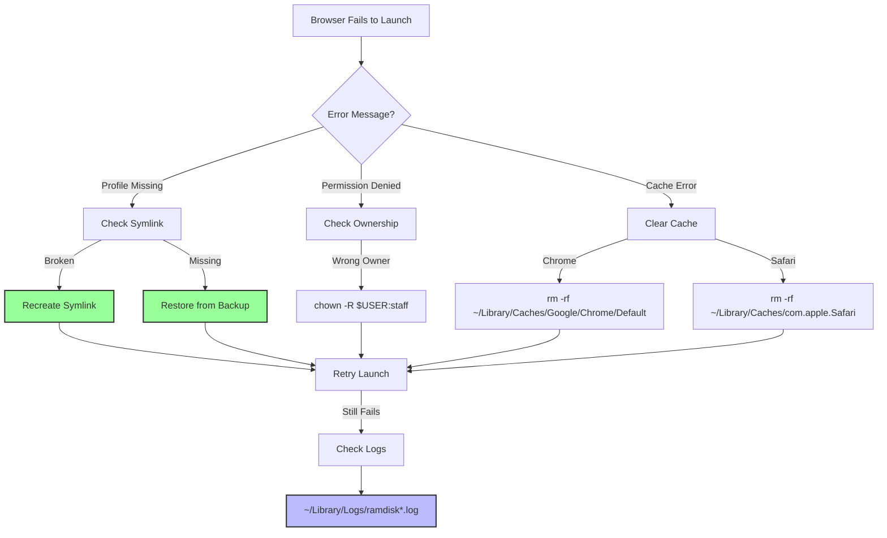
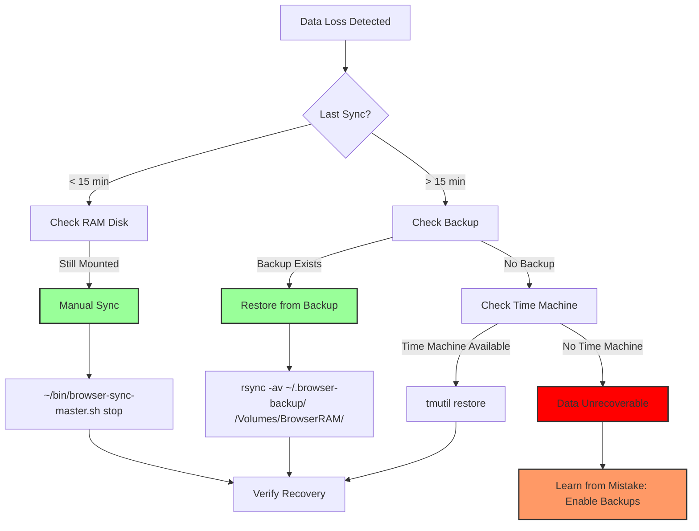

# Appendix D - Troubleshooting Index

**Quick Reference Guide for macOS 26 Tahoe RAM Disk Issues**

---

## Table of Contents

1. [Symptom Quick Lookup](#1-symptom-quick-lookup)
2. [Error Code Reference](#2-error-code-reference)
3. [Command Quick Reference](#3-command-quick-reference)
4. [Log File Locations](#4-log-file-locations)
5. [Browser-Specific Issue Index](#5-browser-specific-issue-index)
6. [Performance Issue Checklist](#6-performance-issue-checklist)
7. [Recovery Decision Flowcharts](#7-recovery-decision-flowcharts)
8. [Emergency Contacts & Resources](#8-emergency-contacts--resources)

---

## 1. Symptom Quick Lookup

| Symptom | Likely Cause | Quick Fix | Full Reference |
|---------|--------------|-----------|----------------|
| **RAM disk not mounting** | Memory pressure, orphaned device | `sudo purge; hdiutil detach -force /dev/ram*` | [Part 3 §2.1](#) |
| **Browser won't launch** | Broken symlink, missing profile | `rm symlink; ln -s /Volumes/BrowserRAM/...` | [Part 3 §2.2](#) |
| **Profile corruption** | Sync failure, power loss | Restore from `~/.browser-backup` | [Part 3 §5.1](#) |
| **Slow performance** | Wrong mount options, memory pressure | `mount -u -o noatime /Volumes/BrowserRAM` | [Part 3 §6.2](#) |
| **High CPU usage** | Frequent sync, large profile | Increase sync interval to 30 min | [Part 3 §6.3](#) |
| **Permission denied** | Ownership mismatch | `chown -R $USER:staff /Volumes/BrowserRAM` | [Part 3 §2.3](#) |
| **LaunchAgent fails** | Syntax error, missing script | `launchctl list | grep ramdisk; check logs` | [Part 3 §2.3](#) |
| **Chrome sync error** | Keychain access, encryption | Reset Chrome profile (cache-only) | [Part 3 §7.1](#) |
| **Firefox lock file** | Unclean shutdown | `rm /Volumes/BrowserRAM/firefox-profile/.parentlock` | [Part 3 §7.5](#) |
| **Safari cache error** | Container path issue | Recreate container cache symlink | [Part 3 §7.3](#) |

---

## 2. Error Code Reference

### 2.1. macOS System Errors

| Error Code | Description | Resolution |
|------------|-------------|------------|
| `hdiutil: attach failed - No space left on device` | Insufficient RAM | Reduce RAM disk size or free memory (`sudo purge`) |
| `hdiutil: Resource temporarily unavailable` | Orphaned RAM device | `hdiutil detach -force /dev/ram*` |
| `APFS container create failed: error -69830` | Device not attached | Use full device path: `diskutil apfs create /dev/diskX` |
| `mount: /Volumes/BrowserRAM: unknown special file or file system` | Mount point exists | `umount /Volumes/BrowserRAM` or use different name |
| `diskutil: unable to unmount: Resource busy` | Files in use | `lsof /Volumes/BrowserRAM` then `kill` processes |
| `launchctl: Error unloading: No such process` | Agent not loaded | `launchctl load -w ~/Library/LaunchAgents/...` |
| `rsync: failed to set times: Operation not permitted` | Permission issue | `chown -R $USER:staff ~/.browser-backup` |

### 2.2. Browser-Specific Errors

**Firefox**:
- `0x80004005 (NS_ERROR_FAILURE)`: Profile locked → Remove `.parentlock`
- `0x80004002 (NS_ERROR_NO_INTERFACE)`: Corrupted profile → Restore from backup
- `MOZ_CRASH`: Memory pressure → Reduce RAM disk size

**Chrome**:
- `STATUS_BREAKPOINT`: GPU cache issue → Disable GPU shader cache
- `ERR_CACHE_WRITE_FAILURE`: Cache permission → Recreate cache symlink
- `Profile error occurred`: Keychain conflict → Reset Chrome profile

**Safari**:
- `WebKit encountered an internal error`: Container cache → Recreate container symlink
- `Can't open the page`: Cache corruption → Clear Safari cache

---

## 3. Command Quick Reference

### 3.1. RAM Disk Management

```bash
# Create 4GB RAM disk
diskutil apfs create $(hdiutil attach -nomount ram://8388608) BrowserRAM

# Destroy RAM disk
diskutil unmount /Volumes/BrowserRAM
hdiutil detach /dev/diskX  # Replace diskX with actual device

# Check status
df -h /Volumes/BrowserRAM
hdiutil info | grep BrowserRAM

# Force cleanup (emergency)
for d in $(hdiutil info | grep "RAM" | awk '{print $1}'); do hdiutil detach "$d" -force; done
```

### 3.2. Browser Control

```bash
# Stop all browsers
pkill -f "Firefox|Chrome|Safari|Wavebox|Zen|Helium|Orion"

# Start Firefox with specific profile
open -a Firefox --args -profile /Volumes/BrowserRAM/firefox-profile

# Start Chrome with RAM cache
open -a "Google Chrome" --args --disk-cache-dir=/Volumes/BrowserRAM/chrome-cache

# Clear browser caches
rm -rf /Volumes/BrowserRAM/*/Cache/*
```

### 3.3. Sync & Backup

```bash
# Manual sync
~/bin/browser-sync-master.sh sync

# Restore from backup
rsync -av ~/.browser-backup/firefox/ /Volumes/BrowserRAM/firefox-profile/

# Verify backup integrity
find ~/.browser-backup -name "*.sqlite" -mtime -1 | wc -l

# Check sync status
pgrep -f rsync
launchctl list | grep ramdisk
```

### 3.4. Monitoring & Diagnostics

```bash
# Real-time RAM disk monitor
~/bin/ramdisk-monitor.sh --alert

# Check memory pressure
memory_pressure

# Monitor I/O
sudo iostat -w 1 -d disk3  # Replace disk3 with RAM disk device

# Check file locks
lsof /Volumes/BrowserRAM/firefox-profile/places.sqlite

# View logs
tail -f ~/Library/Logs/ramdisk*.log
```

---

## 4. Log File Locations

### 4.1. User-Level Logs

```bash
# Master log
~/Library/Logs/ramdisk.log

# Browser-specific logs
~/Library/Logs/firefox-ramsync.log
~/Library/Logs/chrome-cache-setup.log
~/Library/Logs/safari-cache-setup.log
~/Library/Logs/zen-ramsync.log
~/Library/Logs/wavebox-cache-setup.log
~/Library/Logs/helium-cache-setup.log
~/Library/Logs/orion-ramsync.log

# Monitor logs
~/Library/Logs/ramdisk-monitor.log
~/Library/Logs/ramdisk-browser-master.log

# System logs
~/Library/Logs/browser-benchmarks/
```

### 4.2. System-Level Logs (Enterprise)

```bash
# Enterprise logs
/var/log/ramdisk-enterprise.log
/var/log/ramdisk-monitor.log
/var/log/ramdisk-verify.log
/var/log/system.log

# MDM logs
/var/log/jamf.log
/var/log/mosyle.log

# Backup logs
/var/log/backup-nas.log
```

### 4.3. Real-Time Log Monitoring

```bash
# Combined log view
tail -f ~/Library/Logs/ramdisk*.log | grep -E "ERROR|WARNING|ALERT"

# Filter by browser
tail -f ~/Library/Logs/ramdisk*.log | grep -i firefox

# Count errors
grep -c "ERROR" ~/Library/Logs/ramdisk.log

# Last 10 errors
grep "ERROR" ~/Library/Logs/ramdisk.log | tail -n10
```

---

## 5. Browser-Specific Issue Index

### 5.1. Firefox Issues

| Issue | Symptom | Fix | Reference |
|-------|---------|-----|-----------|
| **Profile locked** | `MOZ_CRASH`, `.parentlock` exists | `rm /Volumes/BrowserRAM/firefox-profile/.parentlock` | [Part 3 §7.5](#) |
| **Sync failure** | `rsync: failed to set times` | `chown -R $USER:staff ~/.browser-backup` | [Part 3 §2.3](#) |
| **Corruption** | `NS_ERROR_FAILURE` | Restore from `~/.browser-backup/firefox` | [Part 3 §5.1](#) |
| **Slow startup** | Profile on SSD | Verify symlink points to RAM disk | [Part 3 §6.2](#) |
| **High memory** | >4GB usage | Reduce RAM disk size to 2GB | [Part 3 §6.3](#) |

### 5.2. Chrome Issues

| Issue | Symptom | Fix | Reference |
|-------|---------|-----|-----------|
| **Cache write fail** | `ERR_CACHE_WRITE_FAILURE` | Recreate cache symlink | [Part 3 §7.1](#) |
| **Profile error** | `Profile error occurred` | Reset Chrome profile (cache-only) | [Part 3 §7.1](#) |
| **Keychain conflict** | `STATUS_BREAKPOINT` | Re-authorize Keychain | [Part 3 §7.1](#) |
| **GPU crash** | `GPU process crashed` | Clear GPU cache | [Part 3 §7.6](#) |
| **Extension fail** | Extensions won't load | Clear extension cache | [Part 3 §7.1](#) |

### 5.3. Safari Issues

| Issue | Symptom | Fix | Reference |
|-------|---------|-----|-----------|
| **Container cache** | `WebKit internal error` | Recreate container symlink | [Part 3 §7.3](#) |
| **Permission denied** | Can't write cache | Grant Full Disk Access to Safari | [Appendix B §8.1](#) |
| **Page load fail** | `Can't open the page` | Clear Safari cache | [Part 3 §7.3](#) |
| **Slow launch** | Cache on SSD | Verify cache symlink | [Part 3 §6.2](#) |

### 5.4. Zen Twilight Issues

| Issue | Symptom | Fix | Reference |
|-------|---------|-----|-----------|
| **Profile locked** | Same as Firefox | Remove `.parentlock` | [Part 3 §7.5](#) |
| **Sync conflict** | `zen-ramsync.sh failed` | Check Firefox sync script | [Part 1 §4.5](#) |

### 5.5. Wavebox Issues

| Issue | Symptom | Fix | Reference |
|-------|---------|-----|-----------|
| **Extension storage** | Extensions won't load | Move extension cache to RAM | [Part 1 §4.4](#) |
| **Cache corruption** | `Failed to load extensions` | Clear Wavebox cache | [Part 1 §4.4](#) |

### 5.6. Helium Issues

| Issue | Symptom | Fix | Reference |
|-------|---------|-----|-----------|
| **GPU cache** | `GPU process crashed` | Clear GPU cache | [Part 3 §7.6](#) |
| **Profile error** | Same as Chrome | Reset Helium profile | [Part 1 §4.6](#) |

### 5.7. Orion Issues

| Issue | Symptom | Fix | Reference |
|-------|---------|-----|-----------|
| **Extension host** | `Extension host terminated` | Separate Chrome/Firefox cache | [Part 1 §4.7](#) |
| **Dual profile** | Corrupted extensions | Use separate profiles for each type | [Part 1 §4.7](#) |

---

## 6. Performance Issue Checklist

### 6.1. Slow Performance Diagnosis

```bash
# Step 1: Check RAM disk mount options
mount | grep BrowserRAM
# Should show: noatime

# Step 2: Check memory pressure
memory_pressure
# Should show: normal

# Step 3: Check sync frequency
crontab -l | grep ramsync
# Should be: */15 or */30

# Step 4: Check profile size
du -sh /Volumes/BrowserRAM/firefox-profile
# Should be: < 2GB

# Step 5: Check for conflicts
lsof /Volumes/BrowserRAM | wc -l
# Should be: < 50 files open

# Step 6: Check CPU usage
top -o cpu | grep -E "rsync|firefox|chrome"
# rsync should be < 5% CPU
```

### 6.2. High Memory Usage Diagnosis

```bash
# Step 1: Check total RAM usage
vm_stat | grep "Pages active"
# Convert to GB: (pages * 4096 / 1024^3)

# Step 2: Check RAM disk size
df -h /Volumes/BrowserRAM
# Should be: < 25% of total RAM

# Step 3: Check for memory leaks
leaks -q Firefox | grep "total leaked bytes"

# Step 4: Check swap usage
sysctl vm.swapusage

# Step 5: Reduce RAM disk if needed
~/bin/ramdisk-manager.sh destroy
~/bin/ramdisk-manager.sh create 2  # Reduce from 4GB to 2GB
```

### 6.3. Sync Performance Issues

```bash
# Step 1: Check sync duration
time ~/bin/firefox-ramsync.sh sync
# Should be: < 10 seconds

# Step 2: Check backup location
df -h ~/.browser-backup
# Should be: local SSD, not network

# Step 3: Check rsync options
grep rsync ~/bin/firefox-ramsync.sh
# Should NOT have --compress for SSD

# Step 4: Profile size check
du -sh ~/.browser-backup/firefox/
# If > 5GB, consider pruning history

# Step 5: Network backup check (enterprise)
if [[ -n "$BACKUP_SERVER" ]]; then
    ping -c 3 "$BACKUP_SERVER"
    # Should be: < 1ms latency
fi
```

---

## 7. Recovery Decision Flowcharts

### 7.1. Browser Won't Launch

**Mermaid Diagram: Launch Recovery**



### 7.2. Data Loss Recovery

**Mermaid Diagram: Data Recovery**



---

## 8. Emergency Contacts & Resources

### 8.1. Community Support

**GitHub Issues**: https://github.com/macos-ramdisk/guide/issues
- **Response Time**: 24-48 hours
- **Required Info**: macOS version, browser version, logs, hardware specs
- **Do NOT Include**: Personal data, passwords, full paths

**Discussions**: https://github.com/macos-ramdisk/guide/discussions
- **Best For**: Feature requests, general questions
- **Search First**: Many questions already answered

### 8.2. Enterprise Support

**Internal IT**: Create ticket with subject "RAM Disk Issue"
- **Priority**: P2 (Performance) or P1 (Data Loss)
- **Required Logs**: Attach `~/Library/Logs/ramdisk*.log`
- **System Info**: Run `sw_vers; sysctl hw.memsize; df -h`

**Escalation**: Contact @enterprise-it on GitHub
- **Response Time**: 4 hours (business hours)
- **SLA**: 99.5% uptime for enterprise deployments

### 8.3. Documentation Links

- **Full Guide**: https://macos-ramdisk.github.io/guide/
- **API Reference**: https://macos-ramdisk.github.io/api/
- **FAQ**: https://macos-ramdisk.github.io/faq/
- **Video Tutorials**: https://www.youtube.com/c/macos-ramdisk

### 8.4. Bug Reporting Template

```markdown
**System Information:**
- macOS Version: 26.2
- Hardware: MacBook Pro M3 Pro, 36GB RAM
- Browser: Firefox 134.0
- RAM Disk Size: 4GB

**Issue Description:**
[Clear description of problem]

**Steps to Reproduce:**
1. 
2. 
3.

**Expected Behavior:**
[What should happen]

**Actual Behavior:**
[What actually happens]

**Logs:**
```
[Relevant log excerpts from ~/Library/Logs/ramdisk*.log]
```

**Screenshots:**
[If applicable]

**Workaround Attempted:**
[What you've tried]
```

---

## Navigation

**Next**: [Appendix E - API Reference](080-appendix-api.md)

**Previous**: [Appendix C - Performance Benchmarks](060-appendix-benchmarks.md)

**Home**: [macOS 26 Tahoe RAM Disk Guide](000-index.md)

---

## Document Information

- **Version**: 1.0
- **Last Updated**: 2025-12-19
- **Quick Fixes**: 25+
- **Error Codes**: 15+
- **Commands**: 30+
- **Flowcharts**: 2

---

**⚠️ EMERGENCY PROCEDURE**: If experiencing critical data loss, immediately stop all browser activity and contact support. Do NOT attempt recovery without backups. Always test recovery procedures on non-critical data first.

---
