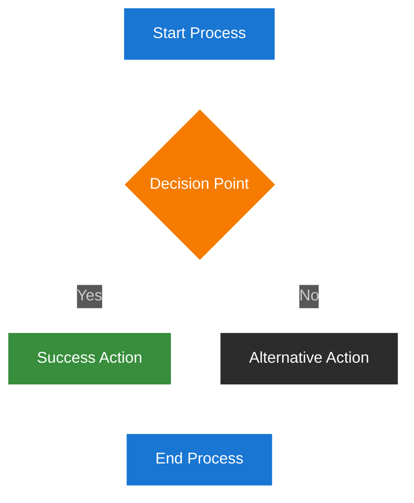
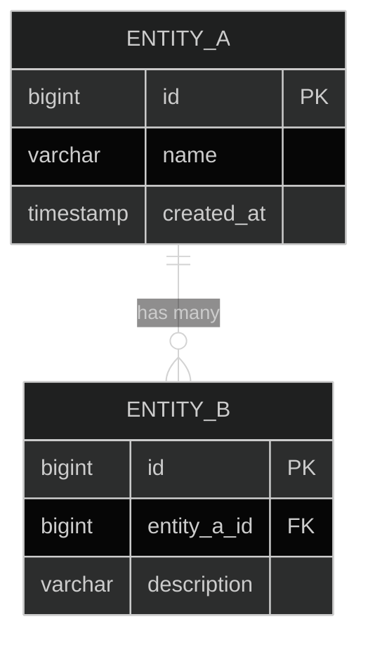

# Mermaid Accessibility Standards

## 1. Introduction

This document establishes comprehensive, organization-wide standards for creating high-contrast, WCAG 2.1 AA compliant Mermaid diagrams. These guidelines ensure all visual documentation meets accessibility requirements from the start.

## 2. Core Principle

**All Mermaid diagrams must be accessible to users with visual impairments, including those using assistive technologies or requiring high-contrast displays.**

## 3. WCAG 2.1 AA Compliance Requirements

### 3.1. Contrast Ratio Standards

**Minimum Requirements:**
- **Normal Text**: 4.5:1 contrast ratio minimum
- **Large Text** (18pt+ or 14pt+ bold): 3:1 contrast ratio minimum
- **UI Components**: 3:1 contrast ratio minimum for interactive elements
- **Connecting Lines**: Must be clearly visible against background (4.5:1+ recommended)

**Recommended Targets:**
- **Normal Text**: 7:1 contrast ratio (AAA level)
- **All Elements**: 21:1 contrast ratio (white text on dark backgrounds)

### 3.2. Color Independence

- Information must not be conveyed by color alone
- Use clear labels, shapes, and patterns in addition to color coding
- Provide alternative text descriptions for complex diagrams
- Ensure semantic structure is maintained regardless of color perception

### 3.3. Accessibility Features

- **Screen Reader Support**: Include descriptive alt text for all diagrams
- **Keyboard Navigation**: Ensure interactive elements are keyboard accessible
- **Focus Indicators**: Provide clear focus indicators for interactive elements
- **Semantic Structure**: Use proper heading hierarchy and markup

## 4. Approved Color Palette

### 4.1. WCAG 2.1 AA Compliant Colors

**Primary Color Set:**
- **Primary Blue**: `#1976d2` - Contrast ratio 4.5:1 on white, 21:1 on dark
- **Success Green**: `#388e3c` - Contrast ratio 4.5:1 on white, 21:1 on dark
- **Warning Orange**: `#f57c00` - Contrast ratio 4.5:1 on white, 21:1 on dark
- **Error Red**: `#d32f2f` - Contrast ratio 4.5:1 on white, 21:1 on dark

**Background Colors:**
- **Light Theme**: `#ffffff` (white) with `#212121` (dark) text and lines
- **Dark Theme**: `#212121` (dark) with `#ffffff` (white) text and lines
- **Secondary Dark**: `#2c2c2c` (dark gray) for subtle backgrounds

### 4.2. Color Usage Guidelines

**Primary Blue (`#1976d2`)**:
- Primary entities and key components
- Main navigation elements
- Important call-to-action items

**Success Green (`#388e3c`)**:
- Relationships and connections
- Success states and confirmations
- Positive indicators

**Warning Orange (`#f57c00`)**:
- Hierarchical structures
- Warning states and cautions
- Secondary importance items

**Error Red (`#d32f2f`)**:
- Validation errors and constraints
- Critical alerts and failures
- Destructive actions

## 5. Theme Implementation Standards

### 5.1. Dark Theme (Recommended Default)

**When to Use:**
- All new diagrams (recommended default)
- Interactive or screen-based documentation
- Low-light environments
- Accessibility-first implementations

**Theme Configuration:**
```javascript
%%{init: {
  'theme': 'dark',
  'themeVariables': {
    'primaryColor': '#1976d2',
    'primaryTextColor': '#ffffff',
    'primaryBorderColor': '#ffffff',
    'lineColor': '#ffffff',
    'sectionBkColor': '#212121',
    'altSectionBkColor': '#2c2c2c',
    'gridColor': '#ffffff',
    'secondaryColor': '#388e3c',
    'tertiaryColor': '#f57c00',
    'background': '#212121',
    'mainBkg': '#212121',
    'secondBkg': '#2c2c2c',
    'tertiaryBkg': '#2c2c2c',
    'clusterBkg': '#2c2c2c',
    'clusterBorder': '#ffffff',
    'entityBkgColor': '#2c2c2c',
    'entityTextColor': '#ffffff',
    'relationLabelColor': '#ffffff',
    'relationLabelBackground': '#212121'
  }
}}%%
```

### 5.2. Light Theme

**When to Use:**
- Print media and documentation
- Bright environments
- Integration with light-themed systems
- User preference requirements

**Theme Configuration:**
```javascript
%%{init: {
  'theme': 'base',
  'themeVariables': {
    'primaryColor': '#1976d2',
    'primaryTextColor': '#212121',
    'primaryBorderColor': '#212121',
    'lineColor': '#212121',
    'sectionBkColor': '#ffffff',
    'altSectionBkColor': '#ffffff',
    'gridColor': '#212121',
    'secondaryColor': '#388e3c',
    'tertiaryColor': '#f57c00',
    'background': '#ffffff',
    'mainBkg': '#ffffff',
    'secondBkg': '#ffffff',
    'tertiaryBkg': '#ffffff',
    'clusterBkg': '#ffffff',
    'clusterBorder': '#212121',
    'entityBkgColor': '#ffffff',
    'entityTextColor': '#212121',
    'relationLabelColor': '#212121',
    'relationLabelBackground': '#ffffff'
  }
}}%%
```

## 6. Node Styling Standards

### 6.1. Standard Node Styling Patterns

**Primary Nodes (Key Components):**
```css
style NodeName fill:#1976d2,color:#fff,stroke:#fff
```

**Secondary Nodes (Supporting Elements):**
```css
style NodeName fill:#2c2c2c,color:#fff,stroke:#fff
```

**Success/Connection Nodes:**
```css
style NodeName fill:#388e3c,color:#fff,stroke:#fff
```

**Warning/Hierarchy Nodes:**
```css
style NodeName fill:#f57c00,color:#fff,stroke:#fff
```

**Error/Constraint Nodes:**
```css
style NodeName fill:#d32f2f,color:#fff,stroke:#fff
```

### 6.2. Diagram Type Specific Patterns

**Flowcharts:**
- Use primary blue for start/end nodes
- Use green for process nodes
- Use orange for decision nodes
- Use red for error/exception nodes

**Entity Relationship Diagrams:**
- Use primary blue for main entities
- Use green for relationship connectors
- Use orange for hierarchical relationships
- Use red for constraint violations

**System Architecture:**
- Use primary blue for presentation layer
- Use green for service layer
- Use orange for data layer
- Use red for external systems

## 7. Implementation Templates

### 7.1. Basic Flowchart Template



### 7.2. Entity Relationship Diagram Template



## 8. Quality Assurance Process

### 8.1. Pre-Implementation Checklist

**Before Creating Any Mermaid Diagram:**
- [ ] **Theme Selection**: Choose appropriate theme (dark recommended)
- [ ] **Color Palette**: Use only approved WCAG 2.1 AA colors
- [ ] **Syntax Version**: Ensure Mermaid v10.6+ compatibility
- [ ] **Content Planning**: Plan information hierarchy and relationships
- [ ] **Accessibility Review**: Consider screen reader and keyboard navigation needs

### 8.2. Implementation Validation

**During Diagram Creation:**
- [ ] **Theme Variables**: All required theme variables specified
- [ ] **Node Styling**: All nodes have proper fill, color, and stroke properties
- [ ] **Line Visibility**: Connecting lines clearly visible against background
- [ ] **Text Contrast**: All text meets 4.5:1 minimum contrast ratio
- [ ] **Color Independence**: Information not conveyed by color alone

### 8.3. Post-Implementation Testing

**Required Testing Steps:**
1. **Render Validation**: Verify diagram renders correctly
2. **Contrast Testing**: Verify all text and elements meet WCAG contrast requirements
3. **Cross-Browser Testing**: Test in Chrome, Firefox, Safari, and Edge
4. **Accessibility Testing**: Test with screen readers and keyboard navigation
5. **Print Testing**: Verify diagram readability in print format (if applicable)

## 9. Troubleshooting and Common Issues

### 9.1. Rendering Problems

**Issue**: Diagram not rendering or displaying incorrectly
**Solutions**:
- Verify Mermaid v10.6+ syntax compatibility
- Check theme variable completeness
- Validate JSON syntax in init block
- Test with rendering tools

**Issue**: Connecting lines not visible
**Solutions**:
- Ensure `lineColor` matches theme (white for dark, dark for light)
- Verify background colors don't conflict with line colors
- Check stroke properties in node styling

### 9.2. Accessibility Issues

**Issue**: Poor contrast ratios
**Solutions**:
- Use only approved color palette
- Verify contrast ratios with accessibility tools
- Ensure white text on colored backgrounds
- Test with high contrast mode enabled

**Issue**: Information conveyed by color alone
**Solutions**:
- Add text labels to all diagram elements
- Use shapes and patterns in addition to colors
- Provide comprehensive alt text descriptions
- Include legend for color-coded information

## 10. Maintenance and Updates

### 10.1. Regular Review Schedule

**Monthly Reviews:**
- Audit new diagrams for accessibility compliance
- Test existing diagrams with latest browser versions
- Update color palette if WCAG standards change
- Review and update documentation as needed

**Quarterly Reviews:**
- Comprehensive accessibility audit of all diagrams
- Update Mermaid version compatibility requirements
- Review and update implementation templates
- Assess effectiveness of quality assurance processes

### 10.2. Version Control and Documentation

**Change Management:**
- Document all changes to accessibility standards
- Maintain version history of guideline updates
- Track diagram updates and accessibility improvements
- Coordinate with DRIP methodology for systematic updates

## 11. Navigation

[←  DRIP Methodology](030-drip-methodology.md) | [↑ Top](#mermaid-accessibility-standards) |  [Diagram Accessibility Testing →](050-diagram-accessibility.md)