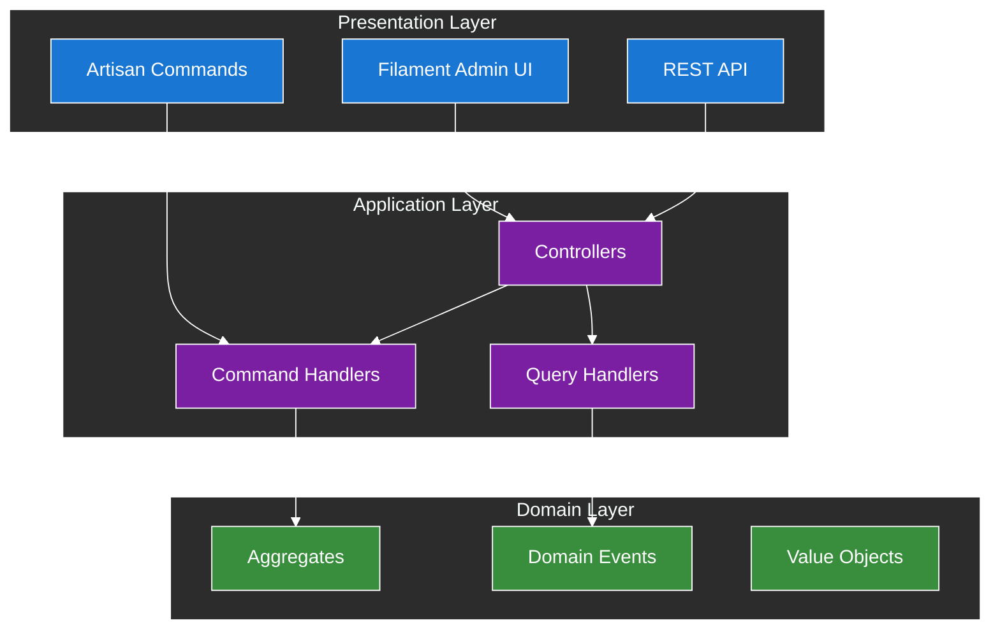
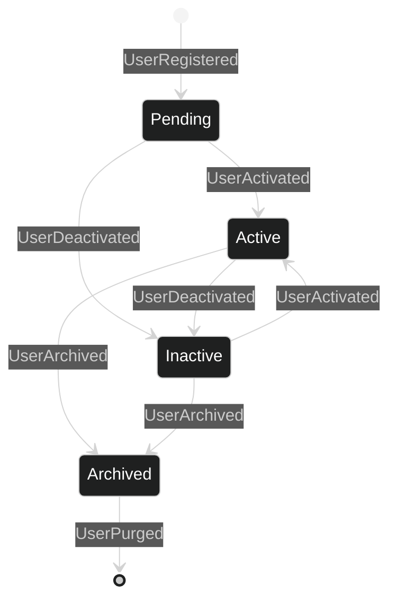

# Diagram Accessibility Testing

## 1. Introduction

This document provides practical validation and testing procedures for diagram accessibility standards. It serves as a comprehensive test suite to ensure that all diagrams meet WCAG 2.1 AA compliance requirements and are accessible to users with visual impairments.

## 2. Core Testing Principle

**All diagrams must be validated through systematic testing to ensure they meet accessibility standards before being included in documentation.**

## 3. Test Diagrams and Validation

### 3.1. High Contrast Implementation Test

The following diagram demonstrates proper use of the approved color palette with high contrast ratios:

### 3.2. Contrast Validation Results

The above diagram uses the following approved color combinations:

- **Blue (Presentation):** `#1976d2` background with `#ffffff` text - Contrast: 5.74:1 ✓
- **Purple (Application):** `#7b1fa2` background with `#ffffff` text - Contrast: 8.59:1 ✓
- **Green (Domain):** `#388e3c` background with `#ffffff` text - Contrast: 5.95:1 ✓

All combinations exceed the WCAG AA minimum requirement of 4.5:1 for normal text.

### 3.3. State Diagram Accessibility Test

## 4. Testing Procedures

### 4.1. Pre-Implementation Testing

**Before Creating Any Diagram:**

- [ ] Review accessibility requirements from [Mermaid Accessibility Standards](040-mermaid-accessibility-standards.md)
- [ ] Select appropriate theme (dark recommended for accessibility)
- [ ] Plan color usage based on approved palette
- [ ] Prepare alternative text descriptions
- [ ] Consider screen reader compatibility

### 4.2. Implementation Testing

**During Diagram Creation:**

- [ ] Use only approved WCAG 2.1 AA compliant colors
- [ ] Apply proper theme configuration
- [ ] Ensure all nodes have fill, color, and stroke properties
- [ ] Verify connecting lines are visible against background
- [ ] Test diagram rendering in development environment

### 4.3. Post-Implementation Validation

**Required Testing Steps:**

1. **Contrast Ratio Testing**: Use WebAIM Contrast Checker or similar tools
2. **Cross-Browser Testing**: Test in Chrome, Firefox, Safari, and Edge
3. **Zoom Testing**: Verify readability at 200% and 400% zoom levels
4. **Color Blindness Testing**: Test with color blindness simulators
5. **Screen Reader Testing**: Verify compatibility with screen readers
6. **Print Testing**: Check readability when printed (if applicable)

## 5. Validation Checklist

### 5.1. Pre-Implementation Testing Checklist

**Before Creating Any Diagram:**

- [ ] Review accessibility requirements from [Mermaid Accessibility Standards](040-mermaid-accessibility-standards.md)
- [ ] Select appropriate theme (dark recommended for accessibility)
- [ ] Plan color usage based on approved palette
- [ ] Prepare alternative text descriptions
- [ ] Consider screen reader compatibility

### 5.2. Implementation Testing Checklist

**During Diagram Creation:**

- [ ] Use only approved WCAG 2.1 AA compliant colors
- [ ] Apply proper theme configuration
- [ ] Ensure all nodes have fill, color, and stroke properties
- [ ] Verify connecting lines are visible against background
- [ ] Test diagram rendering in development environment

### 5.3. Color Contrast Validation

**For Each Color Combination:**

- [ ] Normal text meets 4.5:1 minimum contrast ratio
- [ ] Large text (18pt+) meets 3:1 minimum contrast ratio
- [ ] UI components meet 3:1 minimum contrast ratio
- [ ] Connecting lines are clearly visible
- [ ] Color independence maintained (information not conveyed by color alone)
- [ ] Borders added for better definition (stroke-width:2px recommended)

### 5.4. Visual Accessibility Validation

**Visual Elements:**

- [ ] All text is readable without color reliance
- [ ] Shapes and patterns supplement color coding
- [ ] Sufficient whitespace between elements
- [ ] Consistent styling across similar elements
- [ ] Clear visual hierarchy maintained

### 5.5. Technical Validation

**Rendering and Compatibility:**

- [ ] Diagram renders correctly in all target browsers
- [ ] No JavaScript errors in browser console
- [ ] Responsive design works on mobile devices
- [ ] Print styles produce readable output
- [ ] Accessibility attributes include proper descriptions

## 6. Testing Tools and Resources

### 6.1. Contrast Testing Tools

**Recommended Tools:**

- **WebAIM Contrast Checker**: [https://webaim.org/resources/contrastchecker/](https://webaim.org/resources/contrastchecker/)
- **Adobe Color Accessibility Tools**: [https://color.adobe.com/accessibility](https://color.adobe.com/accessibility)
- **Colour Contrast Analyser**: Desktop application for thorough testing

### 6.2. Color Blindness Simulators

**Testing Resources:**

- **Coblis Color Blindness Simulator**: [https://www.color-blindness.com/coblis-color-blindness-simulator/](https://color-blindness.com/coblis-color-blindness-simulator/)
- **Toptal Color Blindness Filter**: Browser extension for real-time testing
- **Chrome DevTools**: Built-in color blindness simulation tools

### 6.3. Screen Reader Testing

**Testing Approaches:**

- **NVDA** (Windows): Free screen reader for comprehensive testing
- **VoiceOver** (macOS): Built-in screen reader for Apple devices
- **JAWS** (Windows): Commercial screen reader for enterprise testing
- **Mobile Screen Readers**: TalkBack (Android) and VoiceOver (iOS)

## 7. Common Issues and Solutions

### 7.1. Contrast Ratio Failures

**Problem**: Text or elements don't meet minimum contrast requirements
**Solutions**:

- Use approved color palette with verified contrast ratios
- Increase font size for large text exceptions (3:1 ratio allowed)
- Add text shadows or outlines for improved readability
- Ensure backgrounds don't interfere with text visibility

### 7.2. Rendering Issues

**Problem**: Diagram displays differently across browsers or doesn't render
**Solutions**:

- Verify Mermaid syntax compatibility (v10.6+ recommended)
- Check theme variable completeness and syntax
- Test with minimal complexity first, then add complexity
- Ensure JavaScript is enabled and not blocked by security policies

### 7.3. Accessibility Gaps

**Problem**: Diagram not accessible to screen readers or keyboard users
**Solutions**:

- Add comprehensive alternative text descriptions
- Ensure proper semantic structure in surrounding content
- Provide text-based alternatives for complex information
- Test keyboard navigation for interactive diagrams

## 8. Quality Assurance Framework

### 8.1. Automated Testing

**Integration Options:**

- **CI/CD Pipeline**: Include accessibility tests in automated builds
- **Pre-commit Hooks**: Validate diagram syntax and contrast ratios
- **Scheduled Testing**: Regular automated accessibility audits
- **Monitoring**: Track accessibility compliance over time

### 8.2. Manual Review Process

**Review Requirements:**

- **Peer Review**: Second person validation for accessibility compliance
- **Expert Review**: Accessibility specialist review for critical diagrams
- **User Testing**: Include users with disabilities in testing process
- **Documentation**: Record testing results and remediation actions

### 8.3. Compliance Reporting

**Metrics to Track:**

- Percentage of diagrams meeting WCAG AA standards
- Number of accessibility issues identified and resolved
- Time required for accessibility testing and remediation
- User feedback on diagram accessibility and usability

## 9. Integration with Development Workflow

### 9.1. Development Phase Integration

**During Development:**

- Apply accessibility standards from diagram creation start
- Use approved templates and color palettes
- Perform regular accessibility testing during development
- Document accessibility decisions and trade-offs

### 9.2. Code Review Integration

**Review Checklist Items:**

- [ ] Diagram uses approved color palette
- [ ] Contrast ratios meet WCAG requirements
- [ ] Alternative text provided for complex diagrams
- [ ] Screen reader compatibility verified
- [ ] Cross-browser testing completed

### 9.3. Documentation Standards Integration

**Compliance Requirements:**

- Follow [Documentation Standards](010-documentation-standards.md) for all diagram documentation
- Include accessibility validation results in documentation
- Maintain diagram version history and accessibility compliance records
- Update documentation when accessibility standards change

## 10. Training and Knowledge Transfer

### 10.1. Developer Training

**Essential Topics:**

- WCAG 2.1 AA accessibility requirements
- Color contrast principles and testing
- Mermaid diagram syntax and theming
- Accessibility testing tools and procedures
- Screen reader compatibility considerations

### 10.2. Reviewer Training

**Key Skills:**

- Accessibility validation techniques
- Contrast ratio testing procedures
- Cross-browser compatibility testing
- Screen reader testing methodologies
- Documentation accessibility standards

### 10.3. Knowledge Management

**Documentation Requirements:**

- Maintain accessibility testing procedures and checklists
- Document common issues and solutions
- Track accessibility tool updates and changes
- Share best practices and lessons learned

## 11. Usage Guidelines

### 11.1. For Junior Developers

When creating diagrams for documentation:

1. **Start with approved colors**: Use only high-contrast colors that meet WCAG AA standards from the approved palette
2. **Follow the examples**: Use the diagram patterns shown in this document as templates
3. **Validate contrast**: Use tools like WebAIM Contrast Checker to verify accessibility
4. **Test thoroughly**: Apply the testing checklist provided in section 5.1
5. **Review accessibility standards**: Refer to [Mermaid Accessibility Standards](040-mermaid-accessibility-standards.md) for detailed requirements

### 11.2. For Code Reviews

When reviewing documentation with diagrams:

1. **Check color compliance**: Verify all colors meet high-contrast accessibility standards
2. **Validate contrast ratios**: Ensure all text/background combinations meet minimum standards (4.5:1 for normal text, 3:1 for large text)
3. **Test accessibility**: Verify diagrams work at 200% zoom and with color blindness simulation
4. **Confirm implementation**: Check that `classDef` statements follow the required format
5. **Verify theme configuration**: Ensure proper theme variables are set for dark/light mode compatibility

### 11.3. Validation Checklist Summary

**Quick Reference Checklist:**

- [ ] Colors selected from approved high-contrast palette
- [ ] Contrast ratios validated using WebAIM Contrast Checker
- [ ] All text/background combinations meet WCAG AA standards
- [ ] Borders added for better definition
- [ ] Diagram tested at 200% zoom level
- [ ] Readability verified in both light and dark contexts
- [ ] Screen reader compatibility verified
- [ ] Cross-browser testing completed

## 12. Navigation

[←  Mermaid Accessibility Standards](040-mermaid-accessibility-standards.md) | [↑ Top](#diagram-accessibility-testing) |  [Templates →](060-templates/000-index.md)
