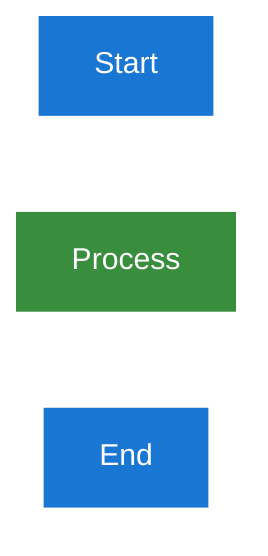

# Documentation Template

**Version:** 1.0
**Created:** 2025-06-17
**Purpose:** Standardized template for creating new documentation with proper formatting, structure, and accessibility compliance

## 1. Template Usage Instructions

This template provides a standardized framework for creating new documentation that follows all established standards and guidelines.

### 1.1. Quick Start Guide

1. **Copy this template** to your documentation directory
2. **Update the document title** and H1 anchor
3. **Customize sections** to match your content needs
4. **Apply proper formatting** throughout the document
5. **Validate accessibility** before publishing

## 2. Document Structure Requirements

### 2.1. Required Elements

Every document must include:
- [ ] H1 heading with anchor: `<a id="document-name"></a>Document Title`
- [ ] Numbered headings (1., 1.1., 1.1.1.) for hierarchy
- [ ] Table of Contents (collapsible format)
- [ ] Navigation footer with Previous | Next | Top links
- [ ] Proper accessibility compliance

### 2.2. File Naming Convention

- **Prefix:** 3-digit number in multiples of 10 (010, 020, 030...)
- **Descriptive Name:** Clear, hyphen-separated filename
- **Extension:** `.md` for all documentation files

### 2.3. Content Organization

- **Clear Introduction:** Purpose and scope of the document
- **Logical Flow:** Information organized from general to specific
- **Practical Examples:** Real-world applications and code samples
- **Cross-References:** Links to related documentation

## 3. Formatting Standards

### 3.1. Heading Structure

```markdown
# Document Title

## 1. Introduction
Content overview...

## 2. Main Section
Section content...

### 2.1. Subsection
Subsection content...

#### 2.1.1. Detailed Topic
Detailed content...
```

### 3.2. Table of Contents Format

```markdown
<details>
<summary>Table of Contents</summary>

- [1. Introduction](#1-introduction)
- [2. Main Section](#2-main-section)
  - [2.1. Subsection](#21-subsection)
  - [2.2. Another Subsection](#22-another-subsection)
- [3. Conclusion](#3-conclusion)

</details>
```

### 3.3. Navigation Footer

```markdown
## 9. Navigation

**← Previous:** [Previous Document](previous-document.md) | **Next →** [Next Document](next-document.md) | **Top**
```

## 4. Accessibility Compliance

### 4.1. WCAG 2.1 AA Requirements

- **Color Contrast:** Minimum 4.5:1 for normal text, 3:1 for large text
- **Code Blocks:** Use dark containers for colored code
- **Diagrams:** Follow Mermaid accessibility standards
- **Alt Text:** Provide descriptions for all images and diagrams

### 4.2. Content Guidelines

- **Clear Language:** Write for junior developers
- **Actionable Content:** Include practical steps and examples
- **Consistent Terminology:** Use standard terminology throughout
- **Comprehensive Coverage:** Include all necessary context

## 5. Code and Syntax Standards

### 5.1. Code Block Formatting

```markdown
```php
// PHP code example with syntax highlighting
function exampleFunction(string $parameter): string
{
    return "Processed: " . $parameter;
}
```
```

### 5.2. Inline Code

Use backticks for inline code: `variable_name`, `function_name()`

### 5.3. Links and References

```markdown
- Internal links: [Link Text](document-name.md#anchor-id)
- External links: [Link Text](https://example.com)
- Code references: `ClassName::methodName()`
```

## 6. Diagram Standards

### 6.1. Mermaid Diagram Configuration



### 6.2. Diagram Accessibility

- [ ] Use approved color palette
- [ ] Add descriptive alt text
- [ ] Ensure high contrast ratios
- [ ] Test with accessibility tools

## 7. Quality Assurance Checklist

### 7.1. Content Validation

- [ ] Content is clear and actionable
- [ ] Examples are practical and tested
- [ ] Cross-references are accurate
- [ ] Terminology is consistent
- [ ] Structure follows logical flow

### 7.2. Technical Validation

- [ ] All internal links work correctly
- [ ] Code examples are syntax-checked
- [ ] Diagrams render properly
- [ ] Accessibility standards are met
- [ ] Formatting is consistent

### 7.3. Compliance Validation

- [ ] WCAG 2.1 AA compliance verified
- [ ] Link integrity confirmed
- [ ] Anchor generation algorithm applied
- [ ] Navigation structure implemented
- [ ] Document standards followed

## 8. Customization Guidelines

### 8.1. Section Adaptation

Modify template sections based on:

- **Document Type:** Tutorial, reference, guide, or specification
- **Target Audience:** Junior developers, senior developers, or mixed
- **Content Complexity:** Simple procedures or comprehensive documentation
- **Integration Requirements:** Connection to existing documentation

### 8.2. Content Examples

Replace template examples with:

- **Real Project Code:** Use actual code from your project
- **Concrete Examples:** Provide specific, applicable examples
- **Step-by-Step Instructions:** Include detailed procedures
- **Troubleshooting Information:** Add common issues and solutions

## 9. Integration with Documentation Standards

### 9.1. Required Standards Compliance

This template ensures compliance with:
- [Documentation Standards](../010-documentation-standards.md)
- [TOC-Heading Synchronization](../020-toc-heading-synchronization.md)
- [Mermaid Accessibility Standards](../040-mermaid-accessibility-standards.md)
- [DRIP Methodology](../030-drip-methodology.md)

### 9.2. Quality Assurance Integration

- **Pre-publishing Validation:** Use checklist before publishing
- **Peer Review Process:** Include in documentation review workflow
- **Accessibility Testing:** Validate with accessibility tools
- **Link Integrity:** Verify all links work correctly

## 10. Maintenance and Updates

### 10.1. Document Lifecycle

- **Creation:** Use template for new documents
- **Review:** Regular content and accuracy reviews
- **Updates:** Keep content current with best practices
- **Archival:** Remove outdated content appropriately

### 10.2. Version Control

- **Change Tracking:** Document significant updates
- **Version History:** Maintain version information
- **Review Dates:** Schedule regular content reviews
- **Stakeholder Approval:** Get approval for major changes

## 11. Navigation

[←  DRIP Task List Template](010-drip-task-list-template.md) | [↑ Top](#documentation-template) |  [Templates Index →](000-index.md)

---

**Template Footer:** This template follows documentation standards and accessibility guidelines. For questions or template improvements, contact the Documentation Team.