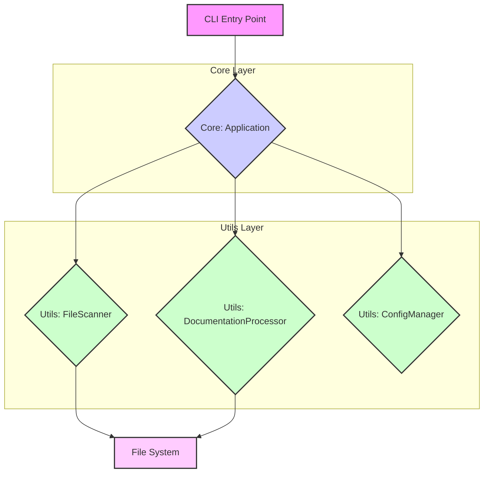

# Application Architecture

The `apply-doc-standards` tool is a command-line application built with PHP. It is designed to be a standalone executable that can be run from the command line.

## High-Level Architecture

The application is composed of three main layers:

1.  **Core Layer**: This layer is responsible for the main application logic, including command-line argument parsing, configuration management, and orchestrating the documentation standards application process.
2.  **Utils Layer**: This layer provides utility classes for file scanning, documentation processing, and configuration management.
3.  **Vendor Layer**: This layer contains the third-party dependencies managed by Composer.

## Mermaid Diagram: High-Level Architecture

## Directory Structure

-   `apply-doc-standards`: The main executable file.
-   `src/`: Contains the source code of the application.
    -   `Core/`: Contains the core application logic.
        -   `Application.php`: The main application class.
    -   `Utils/`: Contains the utility classes.
        -   `ConfigManager.php`: Manages the configuration of the application.
        -   `DocumentationProcessor.php`: Processes the documentation files.
        -   `FileScanner.php`: Scans for files to be processed.
-   `docs/`: Contains the documentation of the application.
-   `tests/`: Contains the tests of the application.
-   `vendor/`: Contains the third-party dependencies.
