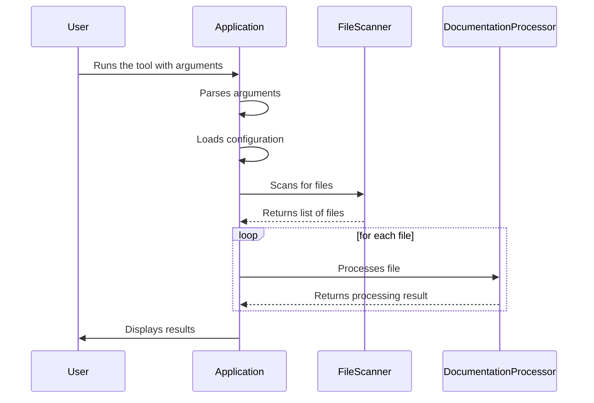
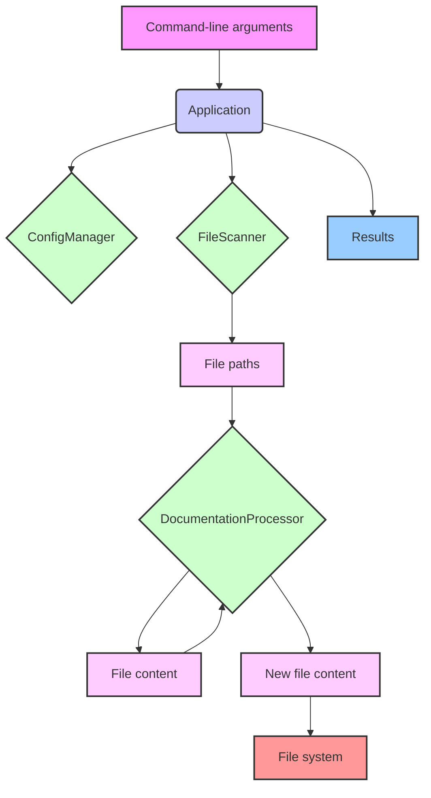

# Process and Data Flows

This document describes the main process and data flows of the `apply-doc-standards` tool.

## Main Process Flow

The main process flow of the application is as follows:

1.  The `Application` class is instantiated.
2.  The `run` method is called with the command-line arguments.
3.  The command-line arguments are parsed.
4.  The configuration is loaded.
5.  The specified paths are processed.
    -   If a path is a directory, the `FileScanner` is used to scan for files.
    -   Each file is processed by the `DocumentationProcessor`.
6.  The results are displayed to the user.

## Mermaid Diagram: Main Process Flow

## Data Flow

The main data flow of the application is as follows:

1.  The command-line arguments are passed to the `Application` class.
2.  The configuration is loaded into the `ConfigManager`.
3.  The `FileScanner` returns an array of file paths.
4.  The `DocumentationProcessor` reads the content of each file, processes it, and writes the new content back to the file.
5.  The processing results are collected and displayed to the user.

## Mermaid Diagram: Data Flow

